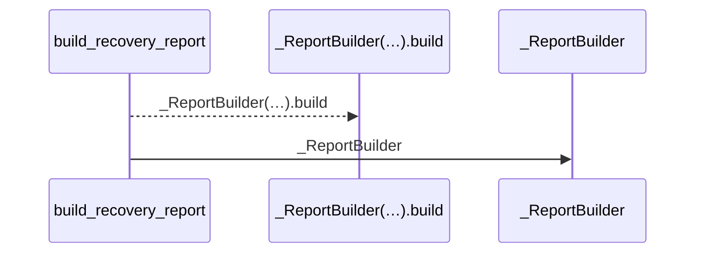

# VB-08 implementation validation

VB-08 is closed. Implementation: `3946a42`.
Companion wiki documentation: `6b45942`.
The [approved backlog](../v201-verified-bugs-20260910-174500.md) retains the
original plan and its separation of confirmed bugs from operational
enhancements. Findings 02 through 04 did not introduce additional code tasks.

## Result and implementation

The reported chained call now renders as:



The same method is visible in the data-flow step and transfer label. Full
expressions and arguments remain in the evidence tables. The constructor and
the unresolved method on its result remain separate observations/participants.

- The shared flow renderer compacts receiver-call arguments using Python
  syntax only. It neither executes source nor infers a returned object's
  class. Parsing is limited to 8,192 characters, the receiver walk to 32 nodes;
  unsupported/malformed expressions have a bounded fallback using the known
  callable name. Ordinary qualified targets and empty receiver calls retain
  their readable form.
- Full expressions and caller scopes still identify external/unresolved
  participants. Display labels normalize before collision detection, reserve
  room for the final method and context, and use a stable ordinal if context
  cannot distinguish them. Repeated identities and genuine recursion retain
  their prior identity. The existing 160-character sanitizer, step-number
  allowance, whole-diagram budgets, and 30-interaction cap remain effective.
- Data-flow transfer copies carry a diagram-only `call_label`. The `call`
  field used by the evidence table stays intact. Different raw transfers do
  not merge merely because their compact display labels match. No inventory,
  observation, flow, or persisted artifact schema changed.
- Bootstrap and sync already share this renderer, so both receive the fix.
  Ordinary sync refreshes older generated labels while preserving authored
  Behavior. README and the companion bootstrap/sync pages describe the actual
  user-visible behavior without internal qualification details.

## Regression and migration evidence

Eight defect assertions failed before implementation; the short-receiver
control passed. The failing cases covered long constructor/factory receivers,
an imported factory, a qualified receiver, nested calls, and compact-label
collisions. The completed change adds 23 regression cases across the existing
bootstrap, diagram, and sync test owners.

Coverage also includes parameter shadowing, malformed legacy expressions,
overlong/deep syntax, subscripts, conditional receivers, Unicode, Mermaid
control punctuation, distinct raw transfers with the same short label, and
rendering without mutating input analysis dictionaries. Existing same-named
target and genuine-recursion checks remain passing.

The [legacy page fixture](../../tests/fixtures/flow-call-result-legacy.md) was
generated with the flow helpers from pre-fix commit `f4ae845`, using the
[portable source fixture](../../tests/fixtures/flow-call-result-source.txt).
The migration test injects that recorded page at bootstrap rendering time so
the real publication path commits a coherent historical artifact set. It then
adds authored Behavior and exercises ordinary sync with the new renderer.
It does not weaken validation or edit native metadata to make migration pass.

| Scenario | Verified result |
|---|---|
| Fresh bootstrap, then its very first sync | Compact labels in both diagrams; flow pages and all three metadata artifacts retain bytes and mtimes |
| Historical generated page plus authored Behavior, then ordinary sync | Labels corrected; page identity and prose preserved; artifact loader reports valid |
| Repeat sync after refresh | Flow pages and metadata retain bytes and mtimes |
| No-cache sync and forced knowledge rebuild | Same stable pages/artifacts on unchanged inputs |
| Flow pages with data flow disabled | Same migration and stability guarantees for the sequence-only surface |
| Strict doctor after each fresh/migrated scenario | Exit 0, with source bytes unchanged |

The [reported-source replay](vb08-reported-source-validation.json) parsed the
same `builder.py` bytes examined during review, without importing the external
application. SHA-256 before and after was
`bebfe3c86f4d117164aa9096e9af87e251f7aee018017d13882ee642030c184d`.
The recorded raw calls, binding facts, legacy edges, and detailed observations
match the pre-fix review exactly. The participant count remains three; method
visibility changes from false to true in the diagrams, and the full expression
remains in the evidence table.

## Checks and practical limits

- The required read-only context gate completed first with one worker and the
  prepared helper cache. Subsequent broad checks ran serially.
- **590 passed, 4 skipped in 85.43 seconds** across the eight owner suites
  listed below. The four skips are existing environment/optional cases.
- After correcting a test import to use the defining service module directly,
  all **26 flow-renderer tests passed in 1.40 seconds**. No product change
  followed the broad owner-suite run.
- **Changed-file Pyright: 0 errors, 0 warnings.** Ruff passed for all changed
  Python files, and they parse with Python 3.9 syntax. Main and companion
  changes pass `git diff --check`.
- The broader repository-wide Pyright check exposed five diagnostics in
  untouched tests. All five reproduce against an isolated archive of the
  pre-change `f4ae845` source and tests with the same virtual environment:
  `test_dependencies.py` lines 150, 265, and 371 infer a list-valued fixture
  dictionary too narrowly; `test_python_import_scopes.py` line 141 accesses
  optional cache stats without narrowing; `test_verified_bug_migrations.py`
  line 185 accesses an optional observation hash without narrowing. They are
  baseline test-typing limitations, not VB-08 regressions, and remain outside
  this implementation. The whole-repository type gate is not reported clean.
- Execution used Linux and project Python 3.14.4. Python 3.9 syntax was checked;
  Windows/macOS runtimes were not exercised. Existing package metadata still
  requires Python 3.10+. No full test suite, package build, release
  requalification, helper preparation, or six-project bootstrap was performed.
  The selected suites and direct source replay cover this presentation change.

Broad owner command:

```bash
.venv/bin/pytest -q \
  tests/test_bootstrap.py tests/test_diagrams.py tests/test_sync.py \
  tests/test_entrypoints.py tests/test_extract.py \
  tests/test_extract_data_flow_details.py tests/test_data_flow.py \
  tests/test_knowledge_generation.py \
  --basetemp /tmp/llm-wiki-vb08-owners --maxfail=1
```

Changed-file type command:

```bash
.venv/bin/pyright \
  src/llm_wiki_cli/services/bootstrap_runtime.py \
  src/llm_wiki_cli/services/diagrams.py \
  tests/test_bootstrap.py tests/test_sync.py tests/test_diagrams.py
```
