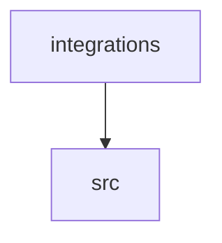

# Dependencies

Internal module dependency graph and external package reconciliation.

## Module graph

<!-- Collapsed to top-level packages; the full module list is in the Fan-in / Fan-out table below. -->

## Cycles

*No import cycles detected.*

> These groups reach each other only from inside functions or under `TYPE_CHECKING`, so nothing is imported while they load and their order is well defined. They are listed because they are cyclic on paper, not because they need fixing.

- [knowledge_cmd](modules/knowledge_cmd.md) ⇄ [knowledge_storage_cmd](modules/knowledge_storage_cmd.md)
- [go_extractor](modules/go_extractor.md) ⇄ [haskell_extractor](modules/haskell_extractor.md) ⇄ [python_extractor](modules/python_extractor.md) ⇄ [rust_extractor](modules/rust_extractor.md) ⇄ [api_contracts](modules/api_contracts.md) ⇄ [services_dependencies](modules/services_dependencies.md) ⇄ [dependency_versions](modules/dependency_versions.md) ⇄ [entrypoints](modules/entrypoints.md) ⇄ [extraction_service](modules/extraction_service.md) ⇄ [extractor_helpers](modules/extractor_helpers.md) ⇄ [imports](modules/imports.md) ⇄ [infrastructure_inventory](modules/infrastructure_inventory.md) ⇄ [infrastructure_sync](modules/infrastructure_sync.md) ⇄ [inventory_cache](modules/inventory_cache.md) ⇄ [knowledge_artifacts](modules/knowledge_artifacts.md) ⇄ [knowledge_envelope](modules/knowledge_envelope.md) ⇄ [knowledge_freshness](modules/knowledge_freshness.md) ⇄ [knowledge_generation](modules/knowledge_generation.md) ⇄ [knowledge_governance](modules/knowledge_governance.md) ⇄ [knowledge_index](modules/knowledge_index.md) ⇄ [knowledge_links](modules/knowledge_links.md) ⇄ [knowledge_model](modules/knowledge_model.md) ⇄ [knowledge_orchestration](modules/knowledge_orchestration.md) ⇄ [knowledge_packs](modules/knowledge_packs.md) ⇄ [knowledge_reuse](modules/knowledge_reuse.md) ⇄ [knowledge_storage](modules/knowledge_storage.md) ⇄ [knowledge_storage_io](modules/knowledge_storage_io.md) ⇄ [manifest_storage](modules/manifest_storage.md) ⇄ [packages](modules/packages.md) ⇄ [python_calls](modules/python_calls.md) ⇄ [python_observations](modules/python_observations.md) ⇄ [source_snapshot](modules/source_snapshot.md) ⇄ [storage_spool](modules/storage_spool.md) ⇄ [sync_manifest](modules/sync_manifest.md)
- [calibration___init__](modules/calibration___init__.md) ⇄ [broker](modules/broker.md) ⇄ [calibration_contracts](modules/calibration_contracts.md) ⇄ [controller](modules/controller.md) ⇄ [host_broker](modules/host_broker.md) ⇄ [documentation_run___init__](modules/documentation_run___init__.md) ⇄ [documentation_run_contracts](modules/documentation_run_contracts.md) ⇄ [documentation_run_dependencies](modules/documentation_run_dependencies.md) ⇄ [export](modules/export.md) ⇄ [integrity](modules/integrity.md) ⇄ [packet](modules/packet.md) ⇄ [prepare](modules/prepare.md) ⇄ [record](modules/record.md) ⇄ [refresh](modules/refresh.md) ⇄ [documentation_run_schema](modules/documentation_run_schema.md) ⇄ [verify](modules/verify.md) ⇄ [workspace](modules/workspace.md)
- [ci_report](modules/ci_report.md) ⇄ [doctor_service](modules/doctor_service.md) ⇄ [health_policy](modules/health_policy.md)
- [context_budget](modules/context_budget.md) ⇄ [context_packet](modules/context_packet.md) ⇄ [context_service](modules/context_service.md) ⇄ [documentation_query_builder](modules/documentation_query_builder.md)
- [knowledge_consumption](modules/knowledge_consumption.md) ⇄ [knowledge_verification](modules/knowledge_verification.md)
- [lint_service](modules/lint_service.md) ⇄ [metrics](modules/metrics.md)
- [task_context](modules/task_context.md) ⇄ [task_context_v2](modules/task_context_v2.md)

## Fan-in / Fan-out

| Module | Fan-in | Fan-out |
|--------|--------|---------|
| [validation](modules/validation.md) | 57 | 0 |
| [config](modules/config.md) | 56 | 3 |
| [services_contracts](modules/services_contracts.md) | 42 | 0 |
| [source_snapshot](modules/source_snapshot.md) | 41 | 7 |
| [io](modules/io.md) | 38 | 1 |
| [source_selection](modules/source_selection.md) | 32 | 2 |
| [sync_manifest](modules/sync_manifest.md) | 32 | 7 |
| [wiki_surface](modules/wiki_surface.md) | 32 | 1 |
| [knowledge_model](modules/knowledge_model.md) | 30 | 10 |
| [knowledge_evidence](modules/knowledge_evidence.md) | 28 | 1 |
| [wiki_surface_index](modules/wiki_surface_index.md) | 25 | 5 |
| [knowledge_artifacts](modules/knowledge_artifacts.md) | 24 | 23 |
| [extraction_service](modules/extraction_service.md) | 21 | 26 |
| [filesystem_guard](modules/filesystem_guard.md) | 21 | 0 |
| [knowledge_consumption](modules/knowledge_consumption.md) | 21 | 6 |
| [knowledge_envelope](modules/knowledge_envelope.md) | 21 | 5 |
| [knowledge_governance](modules/knowledge_governance.md) | 20 | 9 |
| [plugins](modules/plugins.md) | 17 | 3 |
| [knowledge_storage](modules/knowledge_storage.md) | 16 | 7 |
| [common](modules/common.md) | 15 | 1 |
| [bootstrap_runtime](modules/bootstrap_runtime.md) | 15 | 31 |
| [documentation_query_builder](modules/documentation_query_builder.md) | 14 | 15 |
| [knowledge_observability](modules/knowledge_observability.md) | 14 | 9 |
| [progress](modules/progress.md) | 14 | 1 |
| [services_dependencies](modules/services_dependencies.md) | 13 | 8 |
| [knowledge_graph](modules/knowledge_graph.md) | 13 | 6 |
| [wiki_media](modules/wiki_media.md) | 13 | 0 |
| [llm_wiki_cli___init__](modules/llm_wiki_cli___init__.md) | 12 | 0 |
| [context_packet](modules/context_packet.md) | 12 | 26 |
| [documentation_run_dependencies](modules/documentation_run_dependencies.md) | 11 | 24 |
| [extraction_jobs](modules/extraction_jobs.md) | 11 | 0 |
| [knowledge_storage_io](modules/knowledge_storage_io.md) | 11 | 4 |
| [paths](modules/paths.md) | 11 | 0 |
| [documentation_run_contracts](modules/documentation_run_contracts.md) | 10 | 3 |
| [documentation_run_schema](modules/documentation_run_schema.md) | 10 | 2 |
| [knowledge_freshness](modules/knowledge_freshness.md) | 10 | 6 |
| [knowledge_loader](modules/knowledge_loader.md) | 10 | 9 |
| [knowledge_packs](modules/knowledge_packs.md) | 10 | 3 |
| [services_schema](modules/services_schema.md) | 10 | 4 |
| [change_selection](modules/change_selection.md) | 9 | 2 |
| [context_service](modules/context_service.md) | 9 | 28 |
| [documentation_queries](modules/documentation_queries.md) | 9 | 9 |
| [skills](modules/skills.md) | 9 | 2 |
| [workspace](modules/workspace.md) | 8 | 3 |
| [entrypoints](modules/entrypoints.md) | 8 | 4 |
| [imports](modules/imports.md) | 8 | 4 |
| [infrastructure_inventory](modules/infrastructure_inventory.md) | 8 | 1 |
| [inventory_cache](modules/inventory_cache.md) | 8 | 8 |
| [knowledge_orchestration](modules/knowledge_orchestration.md) | 8 | 19 |
| [lint_service](modules/lint_service.md) | 8 | 36 |
| [markdown_sections](modules/markdown_sections.md) | 8 | 1 |
| [integrity](modules/integrity.md) | 7 | 7 |
| [extractor_helpers](modules/extractor_helpers.md) | 7 | 1 |
| [immutable](modules/immutable.md) | 7 | 0 |
| [infrastructure_sync](modules/infrastructure_sync.md) | 7 | 4 |
| [wiki_lifecycle](modules/wiki_lifecycle.md) | 7 | 8 |
| [workflow_profile](modules/workflow_profile.md) | 7 | 1 |
| [api_contracts](modules/api_contracts.md) | 6 | 4 |
| [data_flow](modules/data_flow.md) | 6 | 1 |
| [knowledge_reuse](modules/knowledge_reuse.md) | 6 | 13 |
| [knowledge_verification](modules/knowledge_verification.md) | 6 | 4 |
| [manifest_storage](modules/manifest_storage.md) | 6 | 6 |
| [python_imports](modules/python_imports.md) | 6 | 1 |
| [section_ownership](modules/section_ownership.md) | 6 | 5 |
| [api](modules/api.md) | 5 | 41 |
| [concept_identity](modules/concept_identity.md) | 5 | 1 |
| [refresh](modules/refresh.md) | 5 | 9 |
| [knowledge_projection](modules/knowledge_projection.md) | 5 | 14 |
| [legacy_hooks](modules/legacy_hooks.md) | 5 | 4 |
| [metrics](modules/metrics.md) | 5 | 9 |
| [request_json](modules/request_json.md) | 5 | 0 |
| [storage_spool](modules/storage_spool.md) | 5 | 1 |
| [token_counting](modules/token_counting.md) | 5 | 0 |
| [verification_contracts](modules/verification_contracts.md) | 5 | 5 |
| [calibration___init__](modules/calibration___init__.md) | 4 | 4 |
| [context_budget](modules/context_budget.md) | 4 | 8 |
| [doctor_service](modules/doctor_service.md) | 4 | 16 |
| [documentation_wiki_input](modules/documentation_wiki_input.md) | 4 | 15 |
| [knowledge_index](modules/knowledge_index.md) | 4 | 13 |
| [redaction](modules/redaction.md) | 4 | 0 |
| [rendering_lifecycle](modules/rendering_lifecycle.md) | 4 | 2 |
| [task_contract](modules/task_contract.md) | 4 | 3 |
| [team](modules/team.md) | 4 | 12 |
| [api_types](modules/api_types.md) | 3 | 0 |
| [bootstrap_service](modules/bootstrap_service.md) | 3 | 0 |
| [calibration_contracts](modules/calibration_contracts.md) | 3 | 5 |
| [controller](modules/controller.md) | 3 | 12 |
| [host_broker](modules/host_broker.md) | 3 | 2 |
| [canonical_json](modules/canonical_json.md) | 3 | 0 |
| [ci_report](modules/ci_report.md) | 3 | 6 |
| [circuit_breaker](modules/circuit_breaker.md) | 3 | 0 |
| [context_knowledge_contract](modules/context_knowledge_contract.md) | 3 | 1 |
| [documentation_policy](modules/documentation_policy.md) | 3 | 3 |
| [documentation_run___init__](modules/documentation_run___init__.md) | 3 | 11 |
| [record](modules/record.md) | 3 | 7 |
| [documentation_worklist](modules/documentation_worklist.md) | 3 | 5 |
| [health_contract](modules/health_contract.md) | 3 | 3 |
| [health_summary](modules/health_summary.md) | 3 | 0 |
| [knowledge_coverage](modules/knowledge_coverage.md) | 3 | 3 |
| [maintenance_queue](modules/maintenance_queue.md) | 3 | 4 |
| [runtime_output](modules/runtime_output.md) | 3 | 0 |
| [task_context](modules/task_context.md) | 3 | 19 |
| [generate_prompt_cmd](modules/generate_prompt_cmd.md) | 2 | 12 |
| [knowledge_cmd](modules/knowledge_cmd.md) | 2 | 14 |
| [python_contracts](modules/python_contracts.md) | 2 | 0 |
| [broker](modules/broker.md) | 2 | 5 |
| [ci_installer](modules/ci_installer.md) | 2 | 5 |
| [diagrams](modules/diagrams.md) | 2 | 2 |
| [documentation_native](modules/documentation_native.md) | 2 | 23 |
| [packet](modules/packet.md) | 2 | 5 |
| [verify](modules/verify.md) | 2 | 9 |
| [go_calls](modules/go_calls.md) | 2 | 0 |
| [health_details](modules/health_details.md) | 2 | 9 |
| [health_policy](modules/health_policy.md) | 2 | 1 |
| [knowledge_links](modules/knowledge_links.md) | 2 | 4 |
| [knowledge_storage_access](modules/knowledge_storage_access.md) | 2 | 10 |
| [knowledge_storage_diagnostics](modules/knowledge_storage_diagnostics.md) | 2 | 13 |
| [knowledge_storage_lifecycle](modules/knowledge_storage_lifecycle.md) | 2 | 12 |
| [module_maps](modules/module_maps.md) | 2 | 1 |
| [python_observations](modules/python_observations.md) | 2 | 2 |
| [python_stdlib](modules/python_stdlib.md) | 2 | 0 |
| [relationships](modules/relationships.md) | 2 | 3 |
| [resource_diagnostics](modules/resource_diagnostics.md) | 2 | 0 |
| [review_service](modules/review_service.md) | 2 | 12 |
| [search_service](modules/search_service.md) | 2 | 7 |
| [secure_file](modules/secure_file.md) | 2 | 0 |
| [site_export](modules/site_export.md) | 2 | 8 |
| [site_html_check](modules/site_html_check.md) | 2 | 1 |
| [storage_receipts](modules/storage_receipts.md) | 2 | 3 |
| [storage_sort](modules/storage_sort.md) | 2 | 1 |
| [sync_analysis](modules/sync_analysis.md) | 2 | 3 |
| [task_evidence](modules/task_evidence.md) | 2 | 4 |
| [versioning](modules/versioning.md) | 2 | 0 |
| [api_diff_cmd](modules/api_diff_cmd.md) | 1 | 2 |
| [bump_cmd](modules/bump_cmd.md) | 1 | 1 |
| [ci_check_cmd](modules/ci_check_cmd.md) | 1 | 10 |
| [docs_cmd](modules/docs_cmd.md) | 1 | 5 |
| [doctor_cmd](modules/doctor_cmd.md) | 1 | 4 |
| [init_cmd](modules/init_cmd.md) | 1 | 7 |
| [install_ci_cmd](modules/install_ci_cmd.md) | 1 | 2 |
| [install_cmd](modules/install_cmd.md) | 1 | 3 |
| [knowledge_storage_cmd](modules/knowledge_storage_cmd.md) | 1 | 7 |
| [mcp_cmd](modules/mcp_cmd.md) | 1 | 2 |
| [metrics_cmd](modules/metrics_cmd.md) | 1 | 2 |
| [migrate_cmd](modules/migrate_cmd.md) | 1 | 19 |
| [obsidian_cmd](modules/obsidian_cmd.md) | 1 | 4 |
| [plugins_cmd](modules/plugins_cmd.md) | 1 | 4 |
| [prepare_extractors_cmd](modules/prepare_extractors_cmd.md) | 1 | 4 |
| [query_cmd](modules/query_cmd.md) | 1 | 3 |
| [queue_cmd](modules/queue_cmd.md) | 1 | 1 |
| [release_cmd](modules/release_cmd.md) | 1 | 1 |
| [review_cmd](modules/review_cmd.md) | 1 | 5 |
| [search_cmd](modules/search_cmd.md) | 1 | 2 |
| [site_cmd](modules/site_cmd.md) | 1 | 6 |
| [skills_cmd](modules/skills_cmd.md) | 1 | 2 |
| [status_cmd](modules/status_cmd.md) | 1 | 11 |
| [sync_cmd](modules/sync_cmd.md) | 1 | 33 |
| [task_cmd](modules/task_cmd.md) | 1 | 4 |
| [team_cmd](modules/team_cmd.md) | 1 | 8 |
| [trigger_cmd](modules/trigger_cmd.md) | 1 | 12 |
| [uninstall_cmd](modules/uninstall_cmd.md) | 1 | 8 |
| [upgrade_cmd](modules/upgrade_cmd.md) | 1 | 9 |
| [planner](modules/planner.md) | 1 | 3 |
| [fastapi_contracts](modules/fastapi_contracts.md) | 1 | 0 |
| [go_extractor](modules/go_extractor.md) | 1 | 3 |
| [haskell_extractor](modules/haskell_extractor.md) | 1 | 2 |
| [python_bindings](modules/python_bindings.md) | 1 | 0 |
| [python_extractor](modules/python_extractor.md) | 1 | 7 |
| [rust_extractor](modules/rust_extractor.md) | 1 | 2 |
| [api_diff](modules/api_diff.md) | 1 | 1 |
| [canonical_pages](modules/canonical_pages.md) | 1 | 3 |
| [capability_diagnostics](modules/capability_diagnostics.md) | 1 | 6 |
| [context_session](modules/context_session.md) | 1 | 8 |
| [dependency_versions](modules/dependency_versions.md) | 1 | 3 |
| [documentation_claim_evidence](modules/documentation_claim_evidence.md) | 1 | 4 |
| [documentation_model_policy](modules/documentation_model_policy.md) | 1 | 2 |
| [documentation_review](modules/documentation_review.md) | 1 | 1 |
| [export](modules/export.md) | 1 | 9 |
| [prepare](modules/prepare.md) | 1 | 8 |
| [impact](modules/impact.md) | 1 | 5 |
| [knowledge_audit](modules/knowledge_audit.md) | 1 | 4 |
| [knowledge_generation](modules/knowledge_generation.md) | 1 | 15 |
| [knowledge_stream_audit](modules/knowledge_stream_audit.md) | 1 | 13 |
| [lockfile](modules/lockfile.md) | 1 | 0 |
| [mcp_server](modules/mcp_server.md) | 1 | 23 |
| [native_inspection](modules/native_inspection.md) | 1 | 5 |
| [obsidian](modules/obsidian.md) | 1 | 11 |
| [packages](modules/packages.md) | 1 | 3 |
| [packet_field_policy](modules/packet_field_policy.md) | 1 | 0 |
| [plugin_samples](modules/plugin_samples.md) | 1 | 1 |
| [protected_artifacts](modules/protected_artifacts.md) | 1 | 2 |
| [python_calls](modules/python_calls.md) | 1 | 1 |
| [search_rank](modules/search_rank.md) | 1 | 0 |
| [task_context_v2](modules/task_context_v2.md) | 1 | 23 |
| [wiki_git_policy](modules/wiki_git_policy.md) | 1 | 0 |
| [wiki_scaffold](modules/wiki_scaffold.md) | 1 | 0 |
| [render_summary](modules/render_summary.md) | 0 | 3 |
| [llm-wiki_main](modules/llm-wiki_main.md) | 0 | 0 |
| [src_main](modules/src_main.md) | 0 | 0 |
| [cli](modules/cli.md) | 0 | 42 |
| [hook_cmd](modules/hook_cmd.md) | 0 | 1 |
| [eval_lite___init__](modules/eval_lite___init__.md) | 0 | 1 |
| [detectors](modules/detectors.md) | 0 | 0 |
| [styles](modules/styles.md) | 0 | 0 |
| [extractors___init__](modules/extractors___init__.md) | 0 | 0 |
| [ts_extractor](modules/ts_extractor.md) | 0 | 2 |
| [instruction_ownership](modules/instruction_ownership.md) | 0 | 2 |
| [knowledge_maintenance](modules/knowledge_maintenance.md) | 0 | 18 |

## External dependencies

### python

- **Used:** `mcp`, `pydantic`, `pyyaml`, `tomli`, `uvicorn`
- ⚠️ **Undeclared:** `pydantic`, `uvicorn`

### typescript

- **Used:** `obsidian`

## Notes

The command-line dispatcher is the composition root: it imports command and
service modules so one parser can route the complete product surface. The high
fan-out on `cli` is therefore expected. `validation`, `config`,
`source_snapshot`, `wiki_surface`, and the service contracts have high fan-in
because they centralize boundary rules and shared records rather than product
orchestration.

Nothing imports a cycle into existence at load time. The groups listed above
reach each other only from inside function bodies or under `TYPE_CHECKING`,
which is the boundary each of them was built to have: `calibration` keeps its
initializer free of implementation imports so the OCI stack loads only when a
calibration capability is requested, and `documentation_run` crosses into it
through signature-preserving adapters rather than at module scope. Those lazy
edges are still real coupling, so they count toward fan-in and fan-out; they
just impose no ordering constraint. Keep it that way — a module-scope import
added inside one of these groups would turn it into a genuine cycle.

The optional MCP stack is loaded only when the `mcp` command runs. The direct
`uvicorn` import belongs to HTTP transport and is supplied transitively by the
optional MCP dependency set through the SDK's runtime coupling; project
metadata declares the `mcp` extra rather than `uvicorn` directly, which explains
the static undeclared-package warning. The bundled Rust, Go, and TypeScript
extractor helpers ship their own manifests but are excluded from project-source
discovery, so no language section here can judge their declared crates and
packages; `llm-wiki lint` reports those manifest scopes as skipped rather than
guessing that their dependencies are unused. Extractor plugins are discovered
dynamically and may not appear as ordinary import edges.

This page is a static projection. Conditional imports, runtime plugin loading,
and generated JavaScript bundle wiring can change effective dependencies. For
startup implications, continue with [load order](load-order.md).
