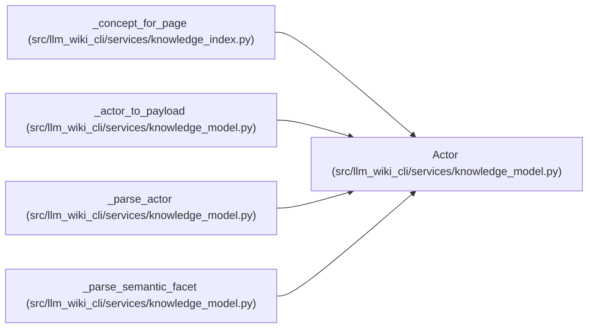

# Actor

**Location:** `src/llm_wiki_cli/services/knowledge_model.py:259`
**Kind:** Class
**Bases:** —
**Module:** [knowledge_model](../modules/knowledge_model.md)

**Decorators:** `@dataclass(frozen=True)`

## Description

_Auto-generated from `Actor` in `src/llm_wiki_cli/services/knowledge_model.py`._

## Attributes

| Name | Type | Default | Description |
|------|------|---------|-------------|
| `kind` | `ActorKind` | `ActorKind.UNKNOWN` | — |
| `actor_id` | `Optional[str]` | `None` | — |
| `version` | `Optional[str]` | `None` | — |
| `model` | `Optional[str]` | `None` | — |
| `organization` | `Optional[str]` | `None` | — |
| `extensions` | `Extensions` | `field(default_factory=dict)` | — |

## Methods

| Method | Signature | Decorators | Description |
|--------|-----------|------------|-------------|
| `id` | `() -> Optional[str]` | `@property` | Return the wire-format actor identifier. |

## Relationships

<!-- Auto-generated relationship summary. Do not edit by hand. -->

### Summary

| Module | Methods | Attributes |
|---|---:|---|
| [knowledge_model](../modules/knowledge_model.md) | 1 | `actor_id`, `extensions`, `kind`, `model`, `organization`, `version` |

### References

| Reference | Kind | Source |
|---|---|---|
| `_concept_for_page` | call | [knowledge_index](../modules/knowledge_index.md) |
| `_actor_to_payload` | type_reference | [knowledge_model](../modules/knowledge_model.md) |
| `_parse_actor` | call | [knowledge_model](../modules/knowledge_model.md) |
| `_parse_actor` | type_reference | [knowledge_model](../modules/knowledge_model.md) |
| `_parse_semantic_facet` | call | [knowledge_model](../modules/knowledge_model.md) |
