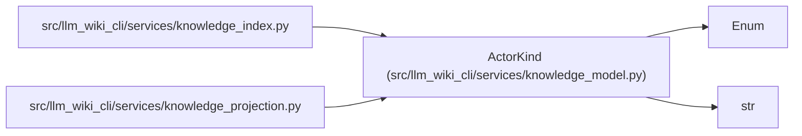

# ActorKind

**Location:** `src/llm_wiki_cli/services/knowledge_model.py:198`
**Kind:** Enum
**Bases:** `str`, `Enum`
**Module:** [knowledge_model](../modules/knowledge_model.md)

## Description

_Auto-generated from `ActorKind` in `src/llm_wiki_cli/services/knowledge_model.py`._

## Attributes

| Name | Declared value | Description |
|------|-------|-------------|
| `UNKNOWN` | `'unknown'` | — |
| `TOOL` | `'tool'` | — |
| `AGENT` | `'agent'` | — |
| `HUMAN` | `'human'` | — |
| `PROCESS` | `'process'` | — |

## Methods

*No public methods. Inherits from base classes.*

## Relationships

<!-- Auto-generated relationship summary. Do not edit by hand. -->

### Summary

| Module | Methods | Attributes |
|---|---:|---|
| [knowledge_model](../modules/knowledge_model.md) | 0 | `AGENT`, `HUMAN`, `PROCESS`, `TOOL`, `UNKNOWN` |

### Structure

| Kind | Entity | Module |
|---|---|---|
| Base | `Enum` | — |
| Base | `str` | — |

### References

| Reference | Kind | Source |
|---|---|---|
| `knowledge_index` | import | [knowledge_index](../modules/knowledge_index.md) |
| `knowledge_projection` | import | [knowledge_projection](../modules/knowledge_projection.md) |
