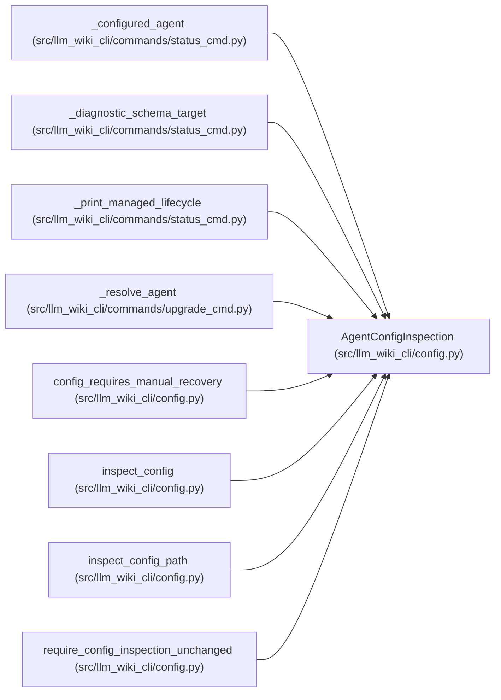

# AgentConfigInspection

**Location:** `src/llm_wiki_cli/config.py:323`
**Kind:** Class
**Bases:** —
**Module:** [config](../modules/config.md)

**Decorators:** `@dataclass(frozen=True)`

## Description

One safe configuration read with provenance for status reporting.

## Attributes

| Name | Type | Default | Description |
|------|------|---------|-------------|
| `state` | `AgentConfigState` | *required* | — |
| `reason` | `str` | *required* | — |
| `path` | `Path` | *required* | — |
| `data` | `dict[str, object]` | *required* | — |
| `raw_bytes` | `bytes \| None` | `None` | — |

## Methods

*No public methods. Inherits from base classes.*

## Relationships

<!-- Auto-generated relationship summary. Do not edit by hand. -->

### Summary

| Module | Methods | Attributes |
|---|---:|---|
| [config](../modules/config.md) | 0 | `data`, `path`, `raw_bytes`, `reason`, `state` |

### References

| Reference | Kind | Source | Call sites |
|---|---|---|---:|
| `_configured_agent` | type_reference | [status_cmd](../modules/status_cmd.md) | — |
| `_diagnostic_schema_target` | type_reference | [status_cmd](../modules/status_cmd.md) | — |
| `_print_managed_lifecycle` | type_reference | [status_cmd](../modules/status_cmd.md) | — |
| `_resolve_agent` | type_reference | [upgrade_cmd](../modules/upgrade_cmd.md) | — |
| `config_requires_manual_recovery` | type_reference | [config](../modules/config.md) | — |
| `inspect_config` | call | [config](../modules/config.md) | 1 |
| `inspect_config` | type_reference | [config](../modules/config.md) | — |
| `inspect_config_path` | call | [config](../modules/config.md) | 10 |
| `inspect_config_path` | type_reference | [config](../modules/config.md) | — |
| `require_config_inspection_unchanged` | type_reference | [config](../modules/config.md) | — |
