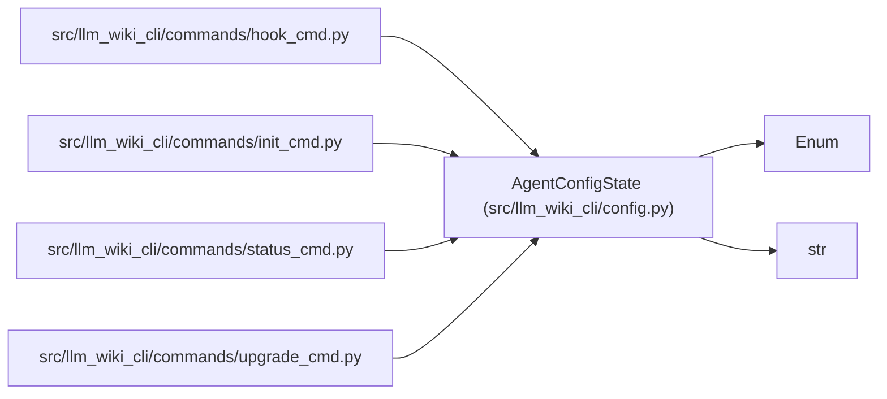

# AgentConfigState

**Location:** `src/llm_wiki_cli/config.py:313`
**Kind:** Enum
**Bases:** `str`, `Enum`
**Module:** [config](../modules/config.md)

## Description

Compatibility classification for the local agent configuration.

## Attributes

| Name | Declared value | Description |
|------|-------|-------------|
| `ABSENT` | `'absent'` | — |
| `VALID` | `'valid'` | — |
| `LEGACY` | `'legacy'` | — |
| `INVALID` | `'invalid'` | — |

## Methods

*No public methods. Inherits from base classes.*

## Relationships

<!-- Auto-generated relationship summary. Do not edit by hand. -->

### Summary

| Module | Methods | Attributes |
|---|---:|---|
| [config](../modules/config.md) | 0 | `ABSENT`, `INVALID`, `LEGACY`, `VALID` |

### Structure

| Kind | Entity | Module |
|---|---|---|
| Base | `Enum` | — |
| Base | `str` | — |

### References

| Reference | Kind | Source | Call sites |
|---|---|---|---:|
| `hook_cmd` | import | [hook_cmd](../modules/hook_cmd.md) | — |
| `init_cmd` | import | [init_cmd](../modules/init_cmd.md) | — |
| `status_cmd` | import | [status_cmd](../modules/status_cmd.md) | — |
| `upgrade_cmd` | import | [upgrade_cmd](../modules/upgrade_cmd.md) | — |
