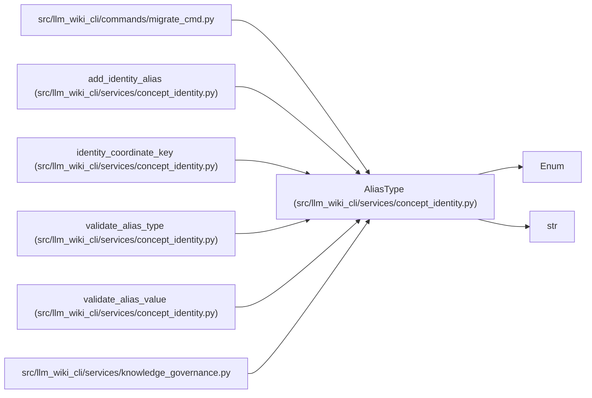

# AliasType

**Location:** `src/llm_wiki_cli/services/concept_identity.py:85`
**Kind:** Enum
**Bases:** `str`, `Enum`
**Module:** [concept_identity](../modules/concept_identity.md)

## Description

The two coordinate namespaces that may retain historical aliases.

## Attributes

| Name | Declared value | Description |
|------|-------|-------------|
| `LOCATOR` | `'locator'` | — |
| `NATURAL_KEY` | `'natural-key'` | — |

## Methods

*No public methods. Inherits from base classes.*

## Relationships

<!-- Auto-generated relationship summary. Do not edit by hand. -->

### Summary

| Module | Methods | Attributes |
|---|---:|---|
| [concept_identity](../modules/concept_identity.md) | 0 | `LOCATOR`, `NATURAL_KEY` |

### Structure

| Kind | Entity | Module |
|---|---|---|
| Base | `Enum` | — |
| Base | `str` | — |

### References

| Reference | Kind | Source |
|---|---|---|
| `migrate_cmd` | import | [migrate_cmd](../modules/migrate_cmd.md) |
| `add_identity_alias` | type_reference | [concept_identity](../modules/concept_identity.md) |
| `identity_coordinate_key` | type_reference | [concept_identity](../modules/concept_identity.md) |
| `validate_alias_type` | call | [concept_identity](../modules/concept_identity.md) |
| `validate_alias_type` | type_reference | [concept_identity](../modules/concept_identity.md) |
| `validate_alias_value` | type_reference | [concept_identity](../modules/concept_identity.md) |
| `knowledge_governance` | import | [knowledge_governance](../modules/knowledge_governance.md) |
