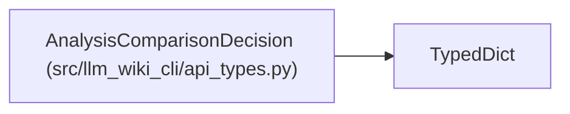

# AnalysisComparisonDecision

**Location:** `src/llm_wiki_cli/api_types.py:600`
**Kind:** Class
**Bases:** `TypedDict`
**Module:** [api_types](../modules/api_types.md)

## Description

_Auto-generated from `AnalysisComparisonDecision` in `src/llm_wiki_cli/api_types.py`._

## Attributes

| Name | Type | Presence | Description |
|------|------|----------|-------------|
| `state` | `str` | *required* | — |
| `reason` | `str` | *required* | — |
| `component` | `str \| None` | *required* | — |

## Methods

*No public methods. Inherits from base classes.*

## Relationships

<!-- Auto-generated relationship summary. Do not edit by hand. -->

### Summary

| Module | Methods | Attributes |
|---|---:|---|
| [api_types](../modules/api_types.md) | 0 | `component`, `reason`, `state` |

### Structure

| Kind | Entity | Module |
|---|---|---|
| Base | `TypedDict` | — |
