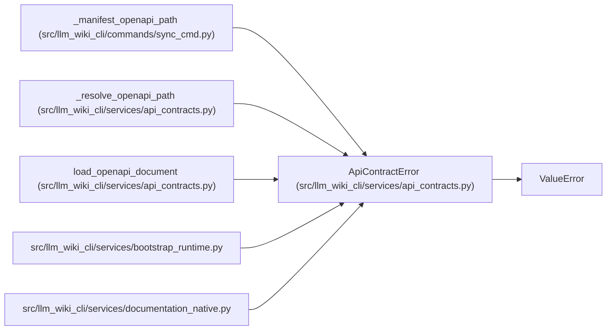

# ApiContractError

**Location:** `src/llm_wiki_cli/services/api_contracts.py:72`
**Kind:** Class
**Bases:** `ValueError`
**Module:** [api_contracts](../modules/api_contracts.md)

## Description

Raised when an API-contract input cannot be consumed safely.

## Attributes

*No annotated attributes found.*

## Methods

*No public methods. Inherits from base classes.*

## Relationships

<!-- Auto-generated relationship summary. Do not edit by hand. -->

### Summary

| Module | Methods | Attributes |
|---|---:|---|
| [api_contracts](../modules/api_contracts.md) | 0 | — |

### Structure

| Kind | Entity | Module |
|---|---|---|
| Base | `ValueError` | — |

### References

| Reference | Kind | Source | Call sites |
|---|---|---|---:|
| `_manifest_openapi_path` | call | [sync_cmd](../modules/sync_cmd.md) | 2 |
| `_resolve_openapi_path` | call | [api_contracts](../modules/api_contracts.md) | 8 |
| `load_openapi_document` | call | [api_contracts](../modules/api_contracts.md) | 7 |
| `bootstrap_runtime` | import | [bootstrap_runtime](../modules/bootstrap_runtime.md) | — |
| `documentation_native` | import | [documentation_native](../modules/documentation_native.md) | — |
