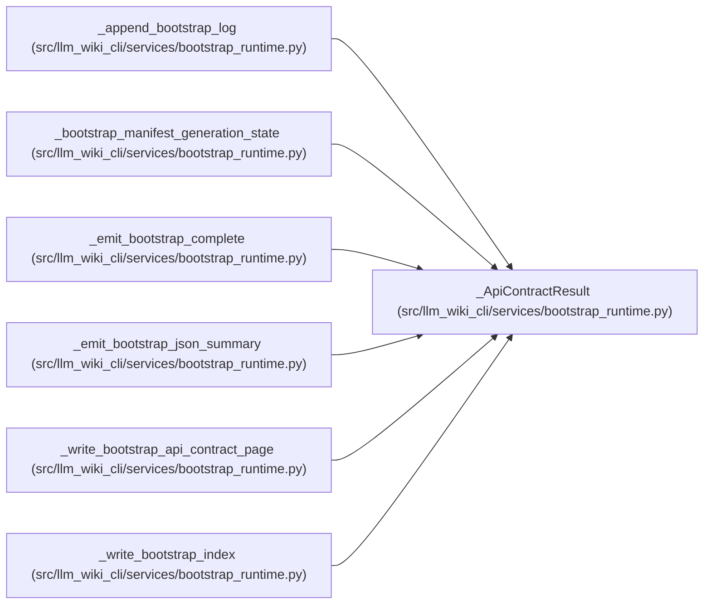

# _ApiContractResult

**Location:** `src/llm_wiki_cli/services/bootstrap_runtime.py:4146`
**Kind:** Class
**Bases:** —
**Module:** [bootstrap_runtime](../modules/bootstrap_runtime.md)

**Decorators:** `@dataclass(frozen=True)`

## Description

_Auto-generated from `_ApiContractResult` in `src/llm_wiki_cli/services/bootstrap_runtime.py`._

## Attributes

| Name | Type | Default | Description |
|------|------|---------|-------------|
| `contracts` | `dict \| None` | *required* | — |
| `present` | `bool` | *required* | — |
| `created` | `int` | *required* | — |

## Methods

*No public methods. Inherits from base classes.*

## Relationships

<!-- Auto-generated relationship summary. Do not edit by hand. -->

### Summary

| Module | Methods | Attributes |
|---|---:|---|
| [bootstrap_runtime](../modules/bootstrap_runtime.md) | 0 | `contracts`, `created`, `present` |

### References

| Reference | Kind | Source |
|---|---|---|
| `_append_bootstrap_log` | type_reference | [bootstrap_runtime](../modules/bootstrap_runtime.md) |
| `_bootstrap_manifest_generation_state` | type_reference | [bootstrap_runtime](../modules/bootstrap_runtime.md) |
| `_emit_bootstrap_complete` | type_reference | [bootstrap_runtime](../modules/bootstrap_runtime.md) |
| `_emit_bootstrap_json_summary` | type_reference | [bootstrap_runtime](../modules/bootstrap_runtime.md) |
| `_write_bootstrap_api_contract_page` | call | [bootstrap_runtime](../modules/bootstrap_runtime.md) |
| `_write_bootstrap_api_contract_page` | call | [bootstrap_runtime](../modules/bootstrap_runtime.md) |
| `_write_bootstrap_api_contract_page` | call | [bootstrap_runtime](../modules/bootstrap_runtime.md) |
| `_write_bootstrap_api_contract_page` | type_reference | [bootstrap_runtime](../modules/bootstrap_runtime.md) |
| `_write_bootstrap_index` | type_reference | [bootstrap_runtime](../modules/bootstrap_runtime.md) |
