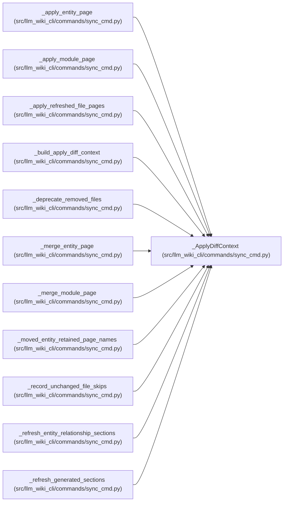

# _ApplyDiffContext

**Location:** `src/llm_wiki_cli/commands/sync_cmd.py:627`
**Kind:** Class
**Bases:** —
**Module:** [sync_cmd](../modules/sync_cmd.md)

**Decorators:** `@dataclass(frozen=True)`

## Description

_Auto-generated from `_ApplyDiffContext` in `src/llm_wiki_cli/commands/sync_cmd.py`._

## Attributes

| Name | Type | Default | Description |
|------|------|---------|-------------|
| `wiki_dir` | `Path` | *required* | — |
| `src_dir` | `str` | *required* | — |
| `inventory` | `dict` | *required* | — |
| `manifest` | `SyncManifest` | *required* | — |
| `entity_page_cache` | `dict[tuple[str, str], str]` | *required* | — |
| `entity_occurrence_page_cache` | `dict[tuple[str, str, int], str]` | *required* | — |
| `module_page_map` | `dict[str, str]` | *required* | — |
| `relationships` | `dict` | *required* | — |
| `generated_sections` | `'_GeneratedSectionContext'` | *required* | — |
| `metadata_only_files` | `set[str]` | *required* | — |
| `current_entity_pages` | `set[str]` | *required* | — |
| `current_module_pages` | `set[str]` | *required* | — |
| `preserve_semantic` | `bool` | *required* | — |
| `include_plugins` | `bool` | `True` | — |
| `source_selection_policy` | `SourceSelectionPolicy \| None` | `None` | — |

## Methods

*No public methods. Inherits from base classes.*

## Relationships

<!-- Auto-generated relationship summary. Do not edit by hand. -->

### Summary

| Module | Methods | Attributes |
|---|---:|---|
| [sync_cmd](../modules/sync_cmd.md) | 0 | `current_entity_pages`, `current_module_pages`, `entity_occurrence_page_cache`, `entity_page_cache`, `generated_sections`, `include_plugins`, `inventory`, `manifest`, `metadata_only_files`, `module_page_map`, `preserve_semantic`, `relationships` |

### References

| Reference | Kind | Source |
|---|---|---|
| `_apply_entity_page` | type_reference | [sync_cmd](../modules/sync_cmd.md) |
| `_apply_module_page` | type_reference | [sync_cmd](../modules/sync_cmd.md) |
| `_apply_refreshed_file_pages` | type_reference | [sync_cmd](../modules/sync_cmd.md) |
| `_build_apply_diff_context` | call | [sync_cmd](../modules/sync_cmd.md) |
| `_build_apply_diff_context` | type_reference | [sync_cmd](../modules/sync_cmd.md) |
| `_deprecate_removed_files` | type_reference | [sync_cmd](../modules/sync_cmd.md) |
| `_merge_entity_page` | type_reference | [sync_cmd](../modules/sync_cmd.md) |
| `_merge_module_page` | type_reference | [sync_cmd](../modules/sync_cmd.md) |
| `_moved_entity_retained_page_names` | type_reference | [sync_cmd](../modules/sync_cmd.md) |
| `_record_unchanged_file_skips` | type_reference | [sync_cmd](../modules/sync_cmd.md) |
| `_refresh_entity_relationship_sections` | type_reference | [sync_cmd](../modules/sync_cmd.md) |
| `_refresh_generated_sections` | type_reference | [sync_cmd](../modules/sync_cmd.md) |
