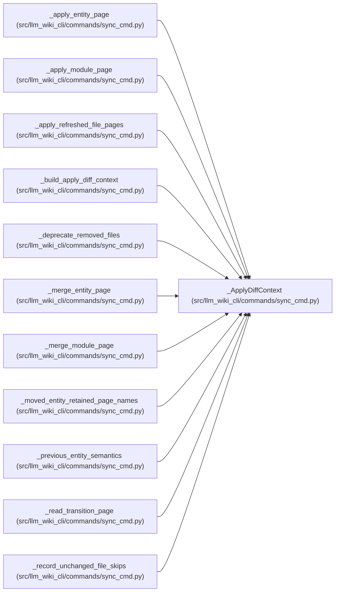

# _ApplyDiffContext

**Location:** `src/llm_wiki_cli/commands/sync_cmd.py:655`
**Kind:** Class
**Bases:** —
**Module:** [sync_cmd](../modules/sync_cmd.md)

**Decorators:** `@dataclass(frozen=True)`

## Description

_Auto-generated from `_ApplyDiffContext` in `src/llm_wiki_cli/commands/sync_cmd.py`._

## Attributes

| Name | Type | Default | Description |
|------|------|---------|-------------|
| `wiki_dir` | `Path` | *required* | — |
| `src_dir` | `str` | *required* | — |
| `inventory` | `dict` | *required* | — |
| `manifest` | `SyncManifest` | *required* | — |
| `entity_page_cache` | `dict[tuple[str, str], str]` | *required* | — |
| `entity_occurrence_page_cache` | `dict[tuple[str, str, int], str]` | *required* | — |
| `module_page_map` | `dict[str, str]` | *required* | — |
| `relationships` | `dict` | *required* | — |
| `generated_sections` | `'_GeneratedSectionContext'` | *required* | — |
| `metadata_only_files` | `set[str]` | *required* | — |
| `current_entity_page_keys` | `set[str]` | *required* | — |
| `current_module_page_keys` | `set[str]` | *required* | — |
| `preserve_semantic` | `bool` | *required* | — |
| `include_plugins` | `bool` | `True` | — |
| `source_selection_policy` | `SourceSelectionPolicy \| None` | `None` | — |
| `page_transitions` | `PageTransitionPlan \| None` | `None` | — |
| `transition_execution` | `PageTransitionExecution \| None` | `None` | — |
| `previous_entity_counts` | `dict[str, Counter[str]]` | `field(default_factory=dict)` | — |

## Methods

*No public methods. Inherits from base classes.*

## Relationships

<!-- Auto-generated relationship summary. Do not edit by hand. -->

```mermaid
flowchart LR
    n0["_ApplyDiffContext (src/llm_wiki_cli/commands/sync_cmd.py)"]
    n1["_apply_entity_page (src/llm_wiki_cli/commands/sync_cmd.py)"]
    n2["_apply_module_page (src/llm_wiki_cli/commands/sync_cmd.py)"]
    n3["_apply_refreshed_file_pages (src/llm_wiki_cli/commands/sync_cmd.py)"]
    n4["_build_apply_diff_context (src/llm_wiki_cli/commands/sync_cmd.py)"]
    n5["_deprecate_removed_files (src/llm_wiki_cli/commands/sync_cmd.py)"]
    n6["_merge_entity_page (src/llm_wiki_cli/commands/sync_cmd.py)"]
    n7["_merge_module_page (src/llm_wiki_cli/commands/sync_cmd.py)"]
    n8["_moved_entity_retained_page_names (src/llm_wiki_cli/commands/sync_cmd.py)"]
    n9["_previous_entity_semantics (src/llm_wiki_cli/commands/sync_cmd.py)"]
    n10["_read_transition_page (src/llm_wiki_cli/commands/sync_cmd.py)"]
    n11["_record_unchanged_file_skips (src/llm_wiki_cli/commands/sync_cmd.py)"]
    n1 --> n0
    n2 --> n0
    n3 --> n0
    n4 --> n0
    n5 --> n0
    n6 --> n0
    n7 --> n0
    n8 --> n0
    n9 --> n0
    n10 --> n0
    n11 --> n0
    click n0 "../modules/sync_cmd.md"
    click n1 "../modules/sync_cmd.md"
    click n2 "../modules/sync_cmd.md"
    click n3 "../modules/sync_cmd.md"
    click n4 "../modules/sync_cmd.md"
    click n5 "../modules/sync_cmd.md"
    click n6 "../modules/sync_cmd.md"
    click n7 "../modules/sync_cmd.md"
    click n8 "../modules/sync_cmd.md"
    click n9 "../modules/sync_cmd.md"
    click n10 "../modules/sync_cmd.md"
    click n11 "../modules/sync_cmd.md"
```

### Summary

| Module | Methods | Attributes |
|---|---:|---|
| [sync_cmd](../modules/sync_cmd.md) | 0 | `current_entity_page_keys`, `current_module_page_keys`, `entity_occurrence_page_cache`, `entity_page_cache`, `generated_sections`, `include_plugins`, `inventory`, `manifest`, `metadata_only_files`, `module_page_map`, `page_transitions`, `preserve_semantic` |

### References

| Reference | Kind | Source | Call sites |
|---|---|---|---:|
| `_apply_entity_page` | type_reference | [sync_cmd](../modules/sync_cmd.md) | — |
| `_apply_module_page` | type_reference | [sync_cmd](../modules/sync_cmd.md) | — |
| `_apply_refreshed_file_pages` | type_reference | [sync_cmd](../modules/sync_cmd.md) | — |
| `_build_apply_diff_context` | call | [sync_cmd](../modules/sync_cmd.md) | 1 |
| `_build_apply_diff_context` | type_reference | [sync_cmd](../modules/sync_cmd.md) | — |
| `_deprecate_removed_files` | type_reference | [sync_cmd](../modules/sync_cmd.md) | — |
| `_merge_entity_page` | type_reference | [sync_cmd](../modules/sync_cmd.md) | — |
| `_merge_module_page` | type_reference | [sync_cmd](../modules/sync_cmd.md) | — |
| `_moved_entity_retained_page_names` | type_reference | [sync_cmd](../modules/sync_cmd.md) | — |
| `_previous_entity_semantics` | type_reference | [sync_cmd](../modules/sync_cmd.md) | — |
| `_read_transition_page` | type_reference | [sync_cmd](../modules/sync_cmd.md) | — |
| `_record_unchanged_file_skips` | type_reference | [sync_cmd](../modules/sync_cmd.md) | — |

> References: showing 12 of 17 logical references; 5 omitted by the 12-row generated summary limit.
