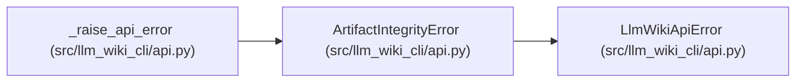

# ArtifactIntegrityError

**Location:** `src/llm_wiki_cli/api.py:340`
**Kind:** Class
**Bases:** `LlmWikiApiError`
**Module:** [api](../modules/api.md)

## Description

Raised when persisted or supplied artifact integrity cannot be trusted.

## Attributes

*No annotated attributes found.*

## Methods

*No public methods. Inherits from base classes.*

## Relationships

<!-- Auto-generated relationship summary. Do not edit by hand. -->

### Summary

| Module | Methods | Attributes |
|---|---:|---|
| [api](../modules/api.md) | 0 | — |

### Structure

| Kind | Entity | Module |
|---|---|---|
| Base | `LlmWikiApiError` | [api](../modules/api.md) |

### References

| Reference | Kind | Source |
|---|---|---|
| `_raise_api_error` | call | [api](../modules/api.md) |
| `_raise_api_error` | call | [api](../modules/api.md) |
| `_raise_api_error` | call | [api](../modules/api.md) |
