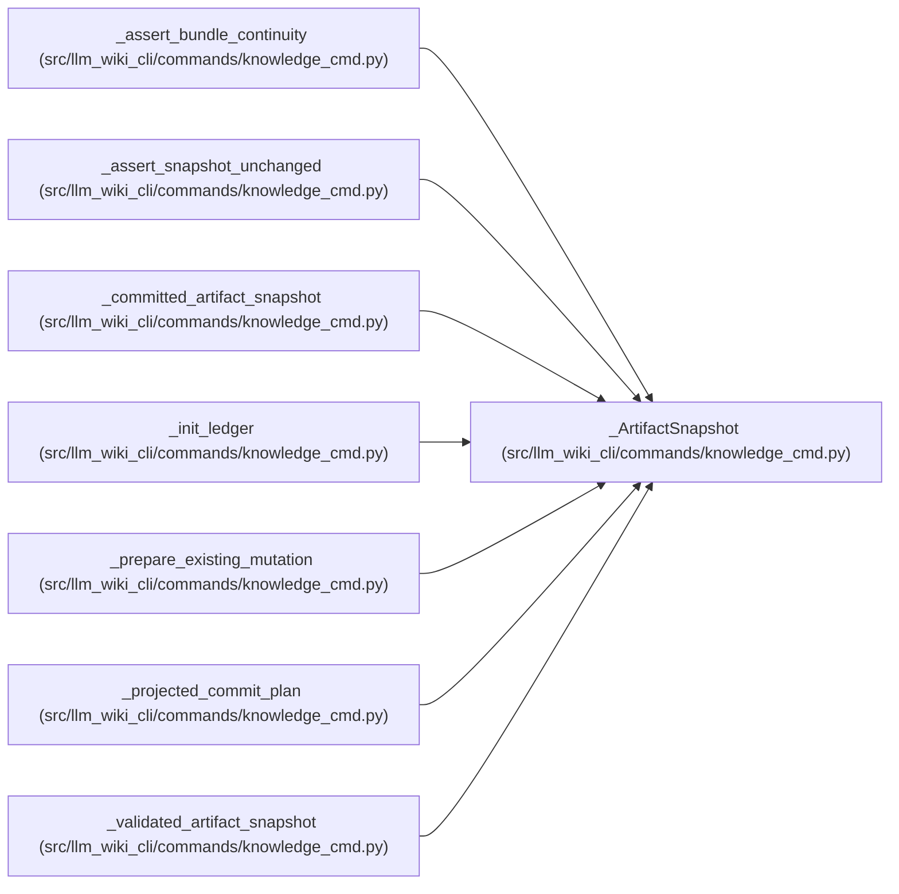

# _ArtifactSnapshot

**Location:** `src/llm_wiki_cli/commands/knowledge_cmd.py:91`
**Kind:** Class
**Bases:** —
**Module:** [knowledge_cmd](../modules/knowledge_cmd.md)

**Decorators:** `@dataclass(frozen=True)`

## Description

_Auto-generated from `_ArtifactSnapshot` in `src/llm_wiki_cli/commands/knowledge_cmd.py`._

## Attributes

| Name | Type | Default | Description |
|------|------|---------|-------------|
| `surface_bytes` | `bytes` | *required* | — |
| `knowledge_bytes` | `bytes` | *required* | — |
| `manifest_bytes` | `bytes` | *required* | — |
| `manifest` | `SyncManifest` | *required* | — |
| `validated` | `ValidatedKnowledgeArtifacts` | *required* | — |

## Methods

*No public methods. Inherits from base classes.*

## Relationships

<!-- Auto-generated relationship summary. Do not edit by hand. -->

### Summary

| Module | Methods | Attributes |
|---|---:|---|
| [knowledge_cmd](../modules/knowledge_cmd.md) | 0 | `knowledge_bytes`, `manifest`, `manifest_bytes`, `surface_bytes`, `validated` |

### References

| Reference | Kind | Source |
|---|---|---|
| `_assert_bundle_continuity` | type_reference | [knowledge_cmd](../modules/knowledge_cmd.md) |
| `_assert_snapshot_unchanged` | type_reference | [knowledge_cmd](../modules/knowledge_cmd.md) |
| `_committed_artifact_snapshot` | call | [knowledge_cmd](../modules/knowledge_cmd.md) |
| `_committed_artifact_snapshot` | type_reference | [knowledge_cmd](../modules/knowledge_cmd.md) |
| `_init_ledger` | type_reference | [knowledge_cmd](../modules/knowledge_cmd.md) |
| `_prepare_existing_mutation` | type_reference | [knowledge_cmd](../modules/knowledge_cmd.md) |
| `_projected_commit_plan` | type_reference | [knowledge_cmd](../modules/knowledge_cmd.md) |
| `_validated_artifact_snapshot` | type_reference | [knowledge_cmd](../modules/knowledge_cmd.md) |
