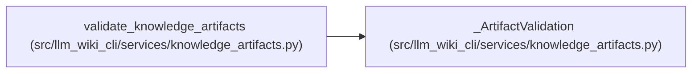

# _ArtifactValidation

**Location:** `src/llm_wiki_cli/services/knowledge_artifacts.py:128`
**Kind:** Class
**Bases:** —
**Module:** [knowledge_artifacts](../modules/knowledge_artifacts.md)

## Description

_Auto-generated from `_ArtifactValidation` in `src/llm_wiki_cli/services/knowledge_artifacts.py`._

## Attributes

*No annotated attributes found.*

## Methods

| Method | Signature | Decorators | Description |
|--------|-----------|------------|-------------|
| `__init__` | `(artifacts: ValidatedKnowledgeArtifacts, surface_bytes: bytes, knowledge_bytes: bytes)` | — | — |
| `__deepcopy__` | `(memo)` | — | — |

## Relationships

<!-- Auto-generated relationship summary. Do not edit by hand. -->

### Summary

| Module | Methods | Attributes |
|---|---:|---|
| [knowledge_artifacts](../modules/knowledge_artifacts.md) | 2 | — |

### References

| Reference | Kind | Source | Call sites |
|---|---|---|---:|
| `validate_knowledge_artifacts` | call | [knowledge_artifacts](../modules/knowledge_artifacts.md) | 1 |
