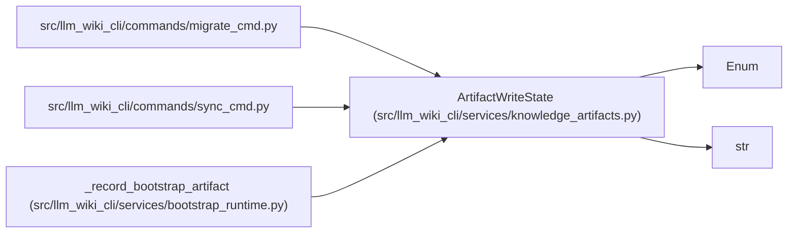

# ArtifactWriteState

**Location:** `src/llm_wiki_cli/services/knowledge_artifacts.py:81`
**Kind:** Enum
**Bases:** `str`, `Enum`
**Module:** [knowledge_artifacts](../modules/knowledge_artifacts.md)

## Description

User-facing state for one planned artifact replacement.

## Attributes

| Name | Declared value | Description |
|------|-------|-------------|
| `CREATED` | `'created'` | — |
| `UPDATED` | `'updated'` | — |
| `UNCHANGED` | `'unchanged'` | — |

## Methods

*No public methods. Inherits from base classes.*

## Relationships

<!-- Auto-generated relationship summary. Do not edit by hand. -->

### Summary

| Module | Methods | Attributes |
|---|---:|---|
| [knowledge_artifacts](../modules/knowledge_artifacts.md) | 0 | `CREATED`, `UNCHANGED`, `UPDATED` |

### Structure

| Kind | Entity | Module |
|---|---|---|
| Base | `Enum` | — |
| Base | `str` | — |

### References

| Reference | Kind | Source |
|---|---|---|
| `migrate_cmd` | import | [migrate_cmd](../modules/migrate_cmd.md) |
| `sync_cmd` | import | [sync_cmd](../modules/sync_cmd.md) |
| `_record_bootstrap_artifact` | type_reference | [bootstrap_runtime](../modules/bootstrap_runtime.md) |
