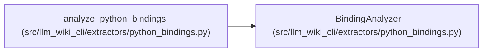

# _BindingAnalyzer

**Location:** `src/llm_wiki_cli/extractors/python_bindings.py:149`
**Kind:** Class
**Bases:** —
**Module:** [python_bindings](../modules/python_bindings.md)

## Description

_Auto-generated from `_BindingAnalyzer` in `src/llm_wiki_cli/extractors/python_bindings.py`._

## Attributes

*No annotated attributes found.*

## Methods

| Method | Signature | Decorators | Description |
|--------|-----------|------------|-------------|
| `__init__` | `()` | — | — |
| `function` | `(node, closure: set[str], class_name: str \| None = None)` | — | — |
| `static_method` | `(node) -> bool` | — | — |
| `expression` | `(node, env: dict, closure: set[str])` | — | — |
| `block` | `(body, env: dict, closure: set[str], *, capture: bool, module: bool = False)` | — | — |

## Relationships

<!-- Auto-generated relationship summary. Do not edit by hand. -->

### Summary

| Module | Methods | Attributes |
|---|---:|---|
| [python_bindings](../modules/python_bindings.md) | 5 | — |

### References

| Reference | Kind | Source | Call sites |
|---|---|---|---:|
| `analyze_python_bindings` | call | [python_bindings](../modules/python_bindings.md) | 1 |
