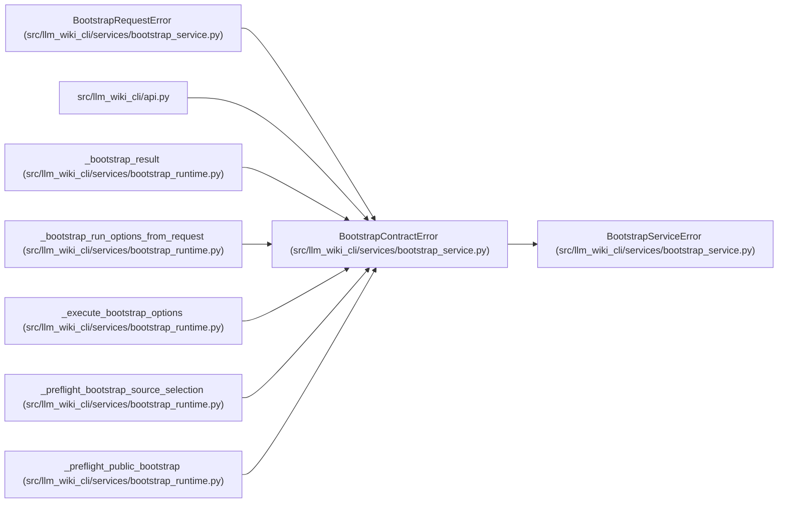

# BootstrapContractError

**Location:** `src/llm_wiki_cli/services/bootstrap_service.py:18`
**Kind:** Class
**Bases:** `BootstrapServiceError`
**Module:** [bootstrap_service](../modules/bootstrap_service.md)

## Description

Raised when bootstrap input or generated contracts are invalid.

## Attributes

*No annotated attributes found.*

## Methods

*No public methods. Inherits from base classes.*

## Relationships

<!-- Auto-generated relationship summary. Do not edit by hand. -->

### Summary

| Module | Methods | Attributes |
|---|---:|---|
| [bootstrap_service](../modules/bootstrap_service.md) | 0 | — |

### Structure

| Kind | Entity | Module |
|---|---|---|
| Base | `BootstrapServiceError` | [bootstrap_service](../modules/bootstrap_service.md) |
| Subclass | `BootstrapRequestError` | [bootstrap_service](../modules/bootstrap_service.md) |

### References

| Reference | Kind | Source |
|---|---|---|
| `api` | import | [api](../modules/api.md) |
| `_bootstrap_result` | call | [bootstrap_runtime](../modules/bootstrap_runtime.md) |
| `_bootstrap_run_options_from_request` | call | [bootstrap_runtime](../modules/bootstrap_runtime.md) |
| `_execute_bootstrap_options` | call | [bootstrap_runtime](../modules/bootstrap_runtime.md) |
| `_execute_bootstrap_options` | call | [bootstrap_runtime](../modules/bootstrap_runtime.md) |
| `_preflight_bootstrap_source_selection` | call | [bootstrap_runtime](../modules/bootstrap_runtime.md) |
| `_preflight_bootstrap_source_selection` | call | [bootstrap_runtime](../modules/bootstrap_runtime.md) |
| `_preflight_public_bootstrap` | call | [bootstrap_runtime](../modules/bootstrap_runtime.md) |
