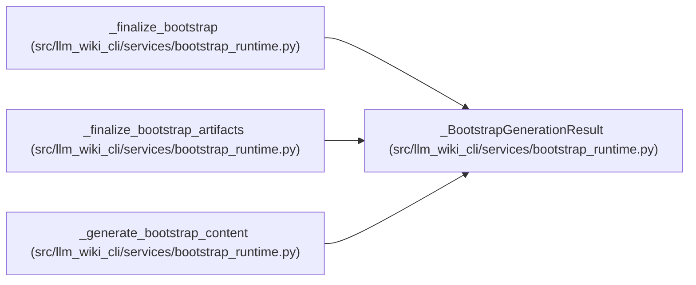

# _BootstrapGenerationResult

**Location:** `src/llm_wiki_cli/services/bootstrap_runtime.py:4152`
**Kind:** Class
**Bases:** —
**Module:** [bootstrap_runtime](../modules/bootstrap_runtime.md)

**Decorators:** `@dataclass(frozen=True)`

## Description

_Auto-generated from `_BootstrapGenerationResult` in `src/llm_wiki_cli/services/bootstrap_runtime.py`._

## Attributes

| Name | Type | Default | Description |
|------|------|---------|-------------|
| `entity` | `_EntityModuleResult` | *required* | — |
| `workflow` | `_WorkflowResult` | *required* | — |
| `flow` | `_FlowResult` | *required* | — |
| `infrastructure` | `_InfrastructureResult` | *required* | — |
| `dependency` | `_DependencyResult` | *required* | — |
| `api_contract` | `_ApiContractResult` | *required* | — |
| `cross_reference_count` | `int` | *required* | — |
| `call_observations` | `dict` | `field(default_factory=dict)` | — |
| `dependency_observations` | `dict` | `field(default_factory=dict)` | — |
| `external_dependencies` | `list[dict]` | `field(default_factory=list)` | — |
| `graph_analyzer_limitations` | `dict[str, tuple[str, ...]]` | `field(default_factory=dict)` | — |

## Methods

*No public methods. Inherits from base classes.*

## Relationships

<!-- Auto-generated relationship summary. Do not edit by hand. -->

### Summary

| Module | Methods | Attributes |
|---|---:|---|
| [bootstrap_runtime](../modules/bootstrap_runtime.md) | 0 | `api_contract`, `call_observations`, `cross_reference_count`, `dependency`, `dependency_observations`, `entity`, `external_dependencies`, `flow`, `graph_analyzer_limitations`, `infrastructure`, `workflow` |

### References

| Reference | Kind | Source |
|---|---|---|
| `_finalize_bootstrap` | type_reference | [bootstrap_runtime](../modules/bootstrap_runtime.md) |
| `_finalize_bootstrap_artifacts` | type_reference | [bootstrap_runtime](../modules/bootstrap_runtime.md) |
| `_generate_bootstrap_content` | call | [bootstrap_runtime](../modules/bootstrap_runtime.md) |
| `_generate_bootstrap_content` | type_reference | [bootstrap_runtime](../modules/bootstrap_runtime.md) |
