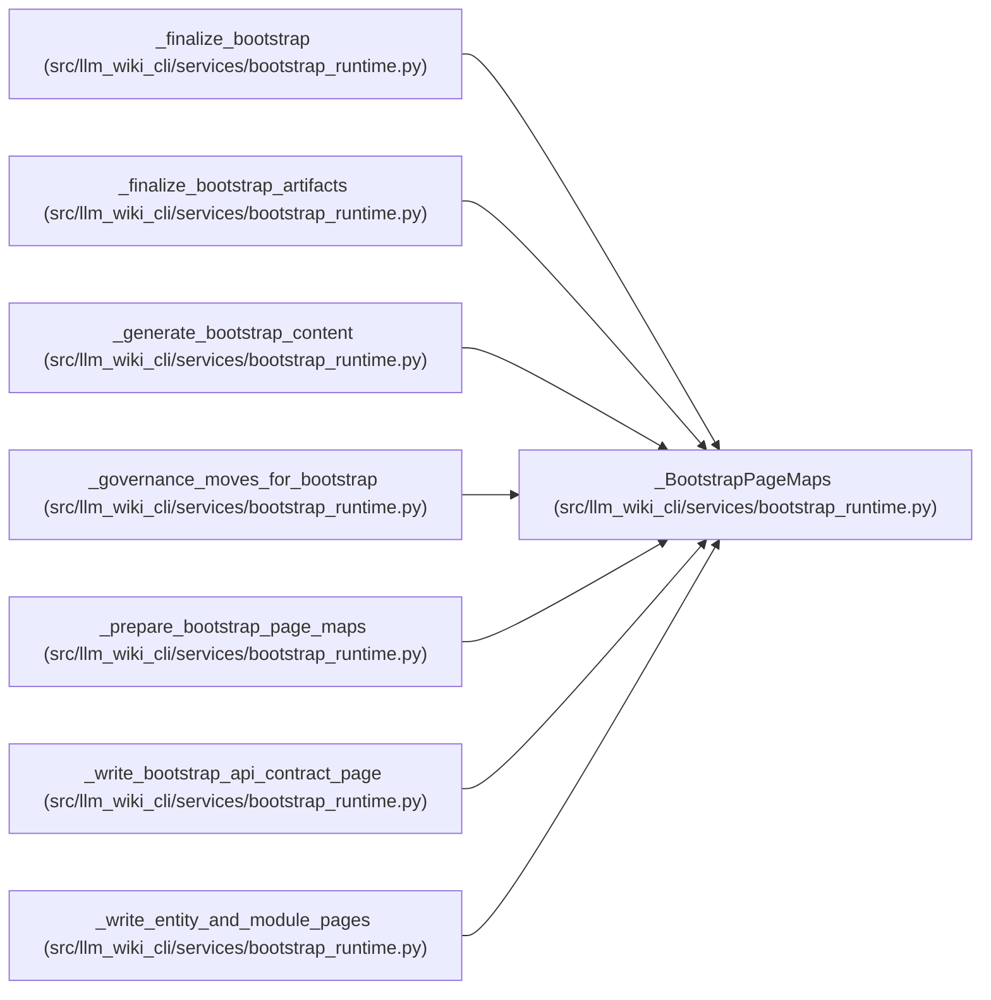

# _BootstrapPageMaps

**Location:** `src/llm_wiki_cli/services/bootstrap_runtime.py:4120`
**Kind:** Class
**Bases:** —
**Module:** [bootstrap_runtime](../modules/bootstrap_runtime.md)

**Decorators:** `@dataclass(frozen=True)`

## Description

_Auto-generated from `_BootstrapPageMaps` in `src/llm_wiki_cli/services/bootstrap_runtime.py`._

## Attributes

| Name | Type | Default | Description |
|------|------|---------|-------------|
| `module_page_map` | `dict[str, str]` | *required* | — |
| `entity_page_name_cache` | `dict[tuple[str, str], str]` | *required* | — |
| `entity_occurrence_page_name_cache` | `dict[EntityOccurrenceKey, str]` | *required* | — |

## Methods

*No public methods. Inherits from base classes.*

## Relationships

<!-- Auto-generated relationship summary. Do not edit by hand. -->

### Summary

| Module | Methods | Attributes |
|---|---:|---|
| [bootstrap_runtime](../modules/bootstrap_runtime.md) | 0 | `entity_occurrence_page_name_cache`, `entity_page_name_cache`, `module_page_map` |

### References

| Reference | Kind | Source | Call sites |
|---|---|---|---:|
| `_finalize_bootstrap` | type_reference | [bootstrap_runtime](../modules/bootstrap_runtime.md) | — |
| `_finalize_bootstrap_artifacts` | type_reference | [bootstrap_runtime](../modules/bootstrap_runtime.md) | — |
| `_generate_bootstrap_content` | type_reference | [bootstrap_runtime](../modules/bootstrap_runtime.md) | — |
| `_governance_moves_for_bootstrap` | type_reference | [bootstrap_runtime](../modules/bootstrap_runtime.md) | — |
| `_prepare_bootstrap_page_maps` | call | [bootstrap_runtime](../modules/bootstrap_runtime.md) | 1 |
| `_prepare_bootstrap_page_maps` | type_reference | [bootstrap_runtime](../modules/bootstrap_runtime.md) | — |
| `_write_bootstrap_api_contract_page` | type_reference | [bootstrap_runtime](../modules/bootstrap_runtime.md) | — |
| `_write_entity_and_module_pages` | type_reference | [bootstrap_runtime](../modules/bootstrap_runtime.md) | — |
