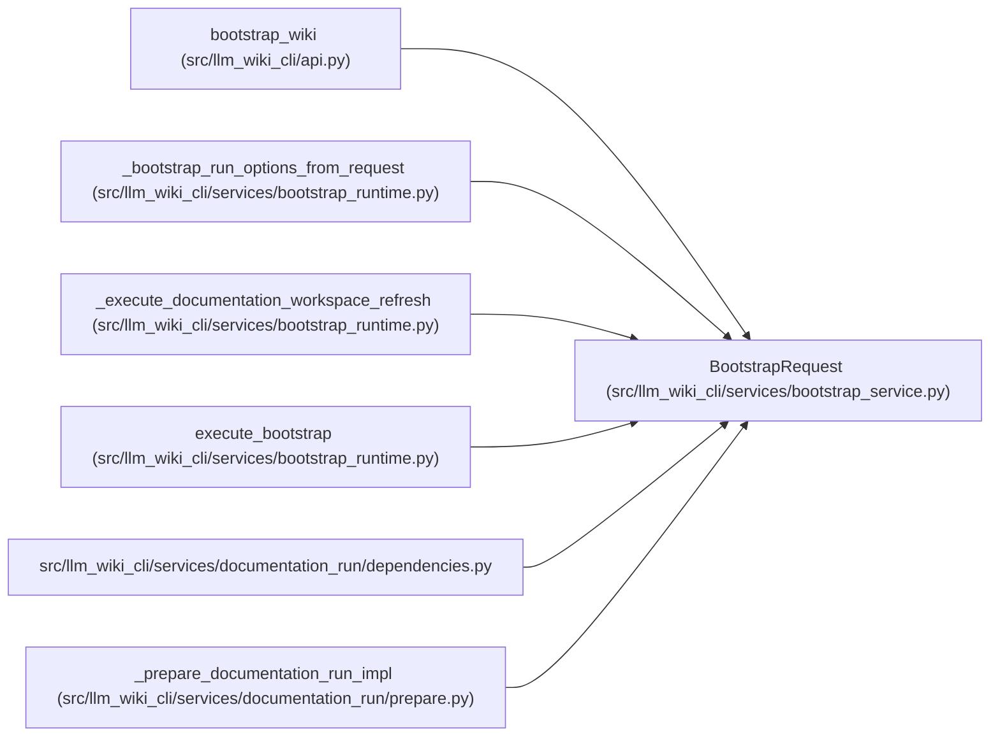

# BootstrapRequest

**Location:** `src/llm_wiki_cli/services/bootstrap_service.py:27`
**Kind:** Class
**Bases:** —
**Module:** [bootstrap_service](../modules/bootstrap_service.md)

**Decorators:** `@dataclass(frozen=True)`

## Description

Deterministic bootstrap inputs shared by CLI and library callers.

``source_adapter`` defaults to true because library callers should not
mutate agent integration files.  The existing CLI explicitly supplies its
historical value when translating argparse options.

``overwrite`` is retained only as a compatibility tombstone.  Public
bootstrap is first-use only and rejects ``overwrite=True`` before source
extraction or target writes.

## Attributes

| Name | Type | Default | Description |
|------|------|---------|-------------|
| `source_root` | `str \| Path` | *required* | — |
| `wiki_root` | `str \| Path` | *required* | — |
| `depth` | `str` | `'full'` | — |
| `skip_workflows` | `bool` | `False` | — |
| `skip_flows` | `bool` | `False` | — |
| `skip_data_flow` | `bool` | `False` | — |
| `skip_dependencies` | `bool` | `False` | — |
| `api_contracts` | `bool` | `False` | — |
| `openapi_file` | `str \| None` | `None` | — |
| `dependency_graph_detail` | `str` | `'auto'` | — |
| `overwrite` | `bool` | `False` | — |
| `source_adapter` | `bool` | `True` | — |
| `helper_cache_dir` | `str \| None` | `None` | — |
| `include_tests` | `Iterable[str] \| None` | `None` | — |
| `trust_source_plugins` | `bool` | `False` | — |
| `source_selection` | `str \| Path \| None` | `None` | — |

## Methods

*No public methods. Inherits from base classes.*

## Relationships

<!-- Auto-generated relationship summary. Do not edit by hand. -->

### Summary

| Module | Methods | Attributes |
|---|---:|---|
| [bootstrap_service](../modules/bootstrap_service.md) | 0 | `api_contracts`, `dependency_graph_detail`, `depth`, `helper_cache_dir`, `include_tests`, `openapi_file`, `overwrite`, `skip_data_flow`, `skip_dependencies`, `skip_flows`, `skip_workflows`, `source_adapter` |

### References

| Reference | Kind | Source |
|---|---|---|
| `bootstrap_wiki` | call | [api](../modules/api.md) |
| `_bootstrap_run_options_from_request` | type_reference | [bootstrap_runtime](../modules/bootstrap_runtime.md) |
| `_execute_documentation_workspace_refresh` | type_reference | [bootstrap_runtime](../modules/bootstrap_runtime.md) |
| `execute_bootstrap` | type_reference | [bootstrap_runtime](../modules/bootstrap_runtime.md) |
| `dependencies` | import | [documentation_run_dependencies](../modules/documentation_run_dependencies.md) |
| `_prepare_documentation_run_impl` | call | [prepare](../modules/prepare.md) |
| `_prepare_documentation_run_impl` | call | [prepare](../modules/prepare.md) |
