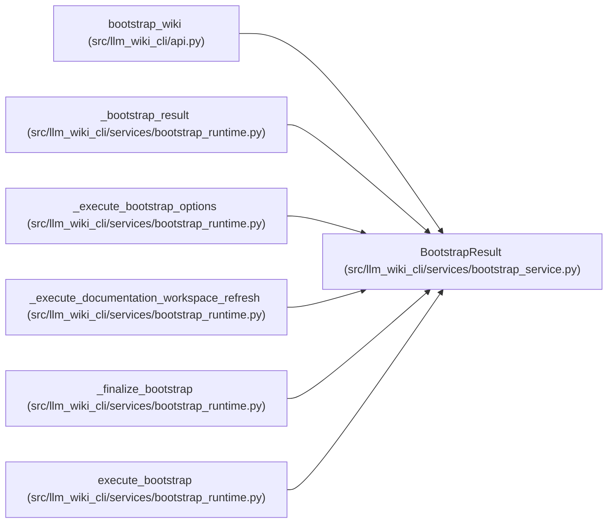

# BootstrapResult

**Location:** `src/llm_wiki_cli/services/bootstrap_service.py:58`
**Kind:** Class
**Bases:** —
**Module:** [bootstrap_service](../modules/bootstrap_service.md)

**Decorators:** `@dataclass(frozen=True)`

## Description

Typed bootstrap result shared by the CLI and Python API.

## Attributes

| Name | Type | Default | Description |
|------|------|---------|-------------|
| `summary` | `dict[str, Any]` | *required* | — |
| `created_files` | `tuple[str, ...]` | `field(default_factory=tuple)` | — |
| `updated_files` | `tuple[str, ...]` | `field(default_factory=tuple)` | — |
| `skipped_files` | `tuple[str, ...]` | `field(default_factory=tuple)` | — |
| `warnings` | `tuple[str, ...]` | `field(default_factory=tuple)` | — |

## Methods

| Method | Signature | Decorators | Description |
|--------|-----------|------------|-------------|
| `schema_version` | `() -> str` | `@property` | — |
| `to_dict` | `() -> dict[str, Any]` | — | — |

## Relationships

<!-- Auto-generated relationship summary. Do not edit by hand. -->

### Summary

| Module | Methods | Attributes |
|---|---:|---|
| [bootstrap_service](../modules/bootstrap_service.md) | 2 | `created_files`, `skipped_files`, `summary`, `updated_files`, `warnings` |

### References

| Reference | Kind | Source | Call sites |
|---|---|---|---:|
| `bootstrap_wiki` | type_reference | [api](../modules/api.md) | — |
| `_bootstrap_result` | call | [bootstrap_runtime](../modules/bootstrap_runtime.md) | 1 |
| `_bootstrap_result` | type_reference | [bootstrap_runtime](../modules/bootstrap_runtime.md) | — |
| `_execute_bootstrap_options` | type_reference | [bootstrap_runtime](../modules/bootstrap_runtime.md) | — |
| `_execute_documentation_workspace_refresh` | type_reference | [bootstrap_runtime](../modules/bootstrap_runtime.md) | — |
| `_finalize_bootstrap` | type_reference | [bootstrap_runtime](../modules/bootstrap_runtime.md) | — |
| `execute_bootstrap` | type_reference | [bootstrap_runtime](../modules/bootstrap_runtime.md) | — |
