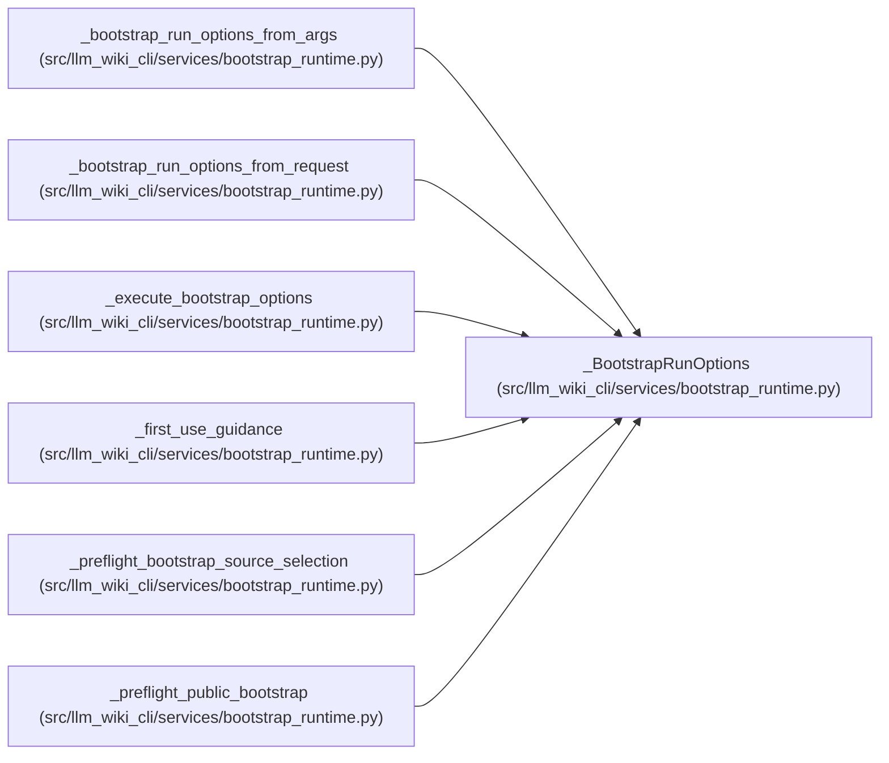

# _BootstrapRunOptions

**Location:** `src/llm_wiki_cli/services/bootstrap_runtime.py:4058`
**Kind:** Class
**Bases:** —
**Module:** [bootstrap_runtime](../modules/bootstrap_runtime.md)

**Decorators:** `@dataclass(frozen=True)`

## Description

_Auto-generated from `_BootstrapRunOptions` in `src/llm_wiki_cli/services/bootstrap_runtime.py`._

## Attributes

| Name | Type | Default | Description |
|------|------|---------|-------------|
| `src_dir` | `str` | *required* | — |
| `wiki_dir` | `Path` | *required* | — |
| `src_dir_for_scan` | `str` | *required* | — |
| `depth` | `str` | *required* | — |
| `deep` | `bool` | *required* | — |
| `skip_workflows` | `bool` | *required* | — |
| `skip_flows` | `bool` | *required* | — |
| `skip_data_flow` | `bool` | *required* | — |
| `skip_dependencies` | `bool` | *required* | — |
| `api_contracts` | `bool` | *required* | — |
| `openapi_file` | `str \| None` | *required* | — |
| `dependency_graph_detail` | `str` | *required* | — |
| `overwrite` | `bool` | *required* | — |
| `json_mode` | `bool` | *required* | — |
| `source_adapter` | `bool` | *required* | — |
| `helper_cache_dir` | `str \| None` | *required* | — |
| `include_tests` | `Iterable[str] \| None` | *required* | — |
| `trust_source_plugins` | `bool` | *required* | — |
| `source_selection` | `str \| Path \| None` | *required* | — |
| `progress_stream` | `TextIO` | *required* | — |

## Methods

*No public methods. Inherits from base classes.*

## Relationships

<!-- Auto-generated relationship summary. Do not edit by hand. -->

### Summary

| Module | Methods | Attributes |
|---|---:|---|
| [bootstrap_runtime](../modules/bootstrap_runtime.md) | 0 | `api_contracts`, `deep`, `dependency_graph_detail`, `depth`, `helper_cache_dir`, `include_tests`, `json_mode`, `openapi_file`, `overwrite`, `progress_stream`, `skip_data_flow`, `skip_dependencies` |

### References

| Reference | Kind | Source |
|---|---|---|
| `_bootstrap_run_options_from_args` | call | [bootstrap_runtime](../modules/bootstrap_runtime.md) |
| `_bootstrap_run_options_from_args` | type_reference | [bootstrap_runtime](../modules/bootstrap_runtime.md) |
| `_bootstrap_run_options_from_request` | call | [bootstrap_runtime](../modules/bootstrap_runtime.md) |
| `_bootstrap_run_options_from_request` | type_reference | [bootstrap_runtime](../modules/bootstrap_runtime.md) |
| `_execute_bootstrap_options` | type_reference | [bootstrap_runtime](../modules/bootstrap_runtime.md) |
| `_first_use_guidance` | type_reference | [bootstrap_runtime](../modules/bootstrap_runtime.md) |
| `_preflight_bootstrap_source_selection` | type_reference | [bootstrap_runtime](../modules/bootstrap_runtime.md) |
| `_preflight_public_bootstrap` | type_reference | [bootstrap_runtime](../modules/bootstrap_runtime.md) |
