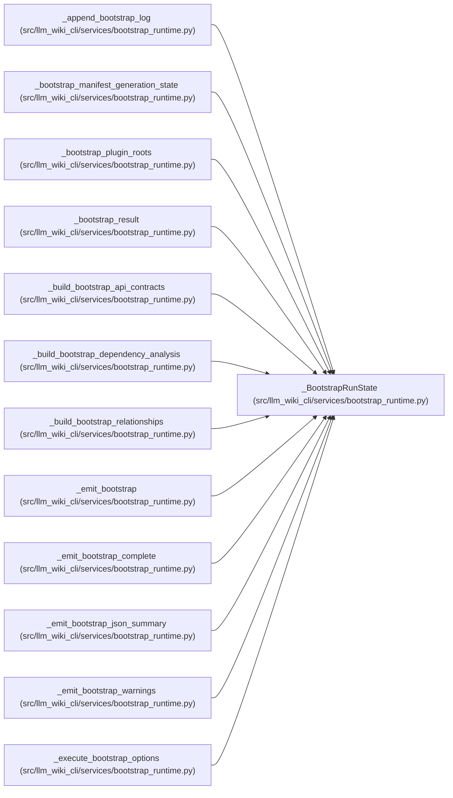

# _BootstrapRunState

**Location:** `src/llm_wiki_cli/services/bootstrap_runtime.py:4083`
**Kind:** Class
**Bases:** —
**Module:** [bootstrap_runtime](../modules/bootstrap_runtime.md)

**Decorators:** `@dataclass`

## Description

_Auto-generated from `_BootstrapRunState` in `src/llm_wiki_cli/services/bootstrap_runtime.py`._

## Attributes

| Name | Type | Default | Description |
|------|------|---------|-------------|
| `options` | `_BootstrapRunOptions` | *required* | — |
| `source_snapshot` | `Any` | `None` | — |
| `created_files` | `list[str]` | `field(default_factory=list)` | — |
| `updated_files` | `list[str]` | `field(default_factory=list)` | — |
| `skipped_files` | `list[str]` | `field(default_factory=list)` | — |
| `warnings` | `list[str]` | `field(default_factory=list)` | — |
| `unsupported_sources` | `dict[str, dict[str, object]]` | `field(default_factory=dict)` | — |
| `written_structural_page_paths` | `set[str]` | `field(default_factory=set)` | — |
| `summary` | `dict[str, Any] \| None` | `None` | — |

## Methods

*No public methods. Inherits from base classes.*

## Relationships

<!-- Auto-generated relationship summary. Do not edit by hand. -->

### Summary

| Module | Methods | Attributes |
|---|---:|---|
| [bootstrap_runtime](../modules/bootstrap_runtime.md) | 0 | `created_files`, `options`, `skipped_files`, `source_snapshot`, `summary`, `unsupported_sources`, `updated_files`, `warnings`, `written_structural_page_paths` |

### References

| Reference | Kind | Source |
|---|---|---|
| `_append_bootstrap_log` | type_reference | [bootstrap_runtime](../modules/bootstrap_runtime.md) |
| `_bootstrap_manifest_generation_state` | type_reference | [bootstrap_runtime](../modules/bootstrap_runtime.md) |
| `_bootstrap_plugin_roots` | type_reference | [bootstrap_runtime](../modules/bootstrap_runtime.md) |
| `_bootstrap_result` | type_reference | [bootstrap_runtime](../modules/bootstrap_runtime.md) |
| `_build_bootstrap_api_contracts` | type_reference | [bootstrap_runtime](../modules/bootstrap_runtime.md) |
| `_build_bootstrap_dependency_analysis` | type_reference | [bootstrap_runtime](../modules/bootstrap_runtime.md) |
| `_build_bootstrap_relationships` | type_reference | [bootstrap_runtime](../modules/bootstrap_runtime.md) |
| `_emit_bootstrap` | type_reference | [bootstrap_runtime](../modules/bootstrap_runtime.md) |
| `_emit_bootstrap_complete` | type_reference | [bootstrap_runtime](../modules/bootstrap_runtime.md) |
| `_emit_bootstrap_json_summary` | type_reference | [bootstrap_runtime](../modules/bootstrap_runtime.md) |
| `_emit_bootstrap_warnings` | type_reference | [bootstrap_runtime](../modules/bootstrap_runtime.md) |
| `_execute_bootstrap_options` | call | [bootstrap_runtime](../modules/bootstrap_runtime.md) |
