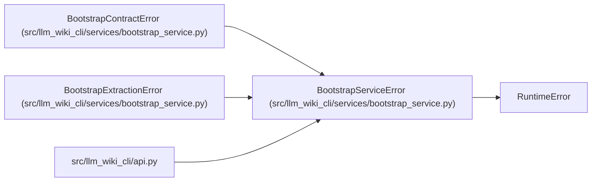

# BootstrapServiceError

**Location:** `src/llm_wiki_cli/services/bootstrap_service.py:10`
**Kind:** Class
**Bases:** `RuntimeError`
**Module:** [bootstrap_service](../modules/bootstrap_service.md)

## Description

Base error raised by the library bootstrap boundary.

## Attributes

*No annotated attributes found.*

## Methods

*No public methods. Inherits from base classes.*

## Relationships

<!-- Auto-generated relationship summary. Do not edit by hand. -->

### Summary

| Module | Methods | Attributes |
|---|---:|---|
| [bootstrap_service](../modules/bootstrap_service.md) | 0 | — |

### Structure

| Kind | Entity | Module |
|---|---|---|
| Base | `RuntimeError` | — |
| Subclass | `BootstrapContractError` | [bootstrap_service](../modules/bootstrap_service.md) |
| Subclass | `BootstrapExtractionError` | [bootstrap_service](../modules/bootstrap_service.md) |

### References

| Reference | Kind | Source |
|---|---|---|
| `api` | import | [api](../modules/api.md) |
