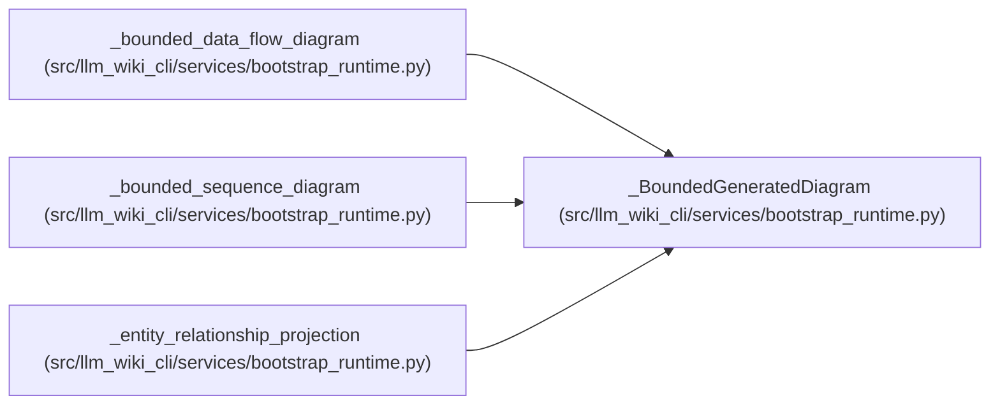

# _BoundedGeneratedDiagram

**Location:** `src/llm_wiki_cli/services/bootstrap_runtime.py:701`
**Kind:** Class
**Bases:** —
**Module:** [bootstrap_runtime](../modules/bootstrap_runtime.md)

**Decorators:** `@dataclass(frozen=True)`

## Description

_Auto-generated from `_BoundedGeneratedDiagram` in `src/llm_wiki_cli/services/bootstrap_runtime.py`._

## Attributes

| Name | Type | Default | Description |
|------|------|---------|-------------|
| `diagram` | `str \| None` | *required* | — |
| `total_items` | `int` | *required* | — |
| `shown_items` | `int` | *required* | — |
| `omitted_items` | `int` | *required* | — |

## Methods

*No public methods. Inherits from base classes.*

## Relationships

<!-- Auto-generated relationship summary. Do not edit by hand. -->

### Summary

| Module | Methods | Attributes |
|---|---:|---|
| [bootstrap_runtime](../modules/bootstrap_runtime.md) | 0 | `diagram`, `omitted_items`, `shown_items`, `total_items` |

### References

| Reference | Kind | Source | Call sites |
|---|---|---|---:|
| `_bounded_data_flow_diagram` | call | [bootstrap_runtime](../modules/bootstrap_runtime.md) | 2 |
| `_bounded_data_flow_diagram` | type_reference | [bootstrap_runtime](../modules/bootstrap_runtime.md) | — |
| `_bounded_sequence_diagram` | call | [bootstrap_runtime](../modules/bootstrap_runtime.md) | 1 |
| `_bounded_sequence_diagram` | type_reference | [bootstrap_runtime](../modules/bootstrap_runtime.md) | — |
| `_entity_relationship_projection` | call | [bootstrap_runtime](../modules/bootstrap_runtime.md) | 2 |
| `_entity_relationship_projection` | type_reference | [bootstrap_runtime](../modules/bootstrap_runtime.md) | — |
