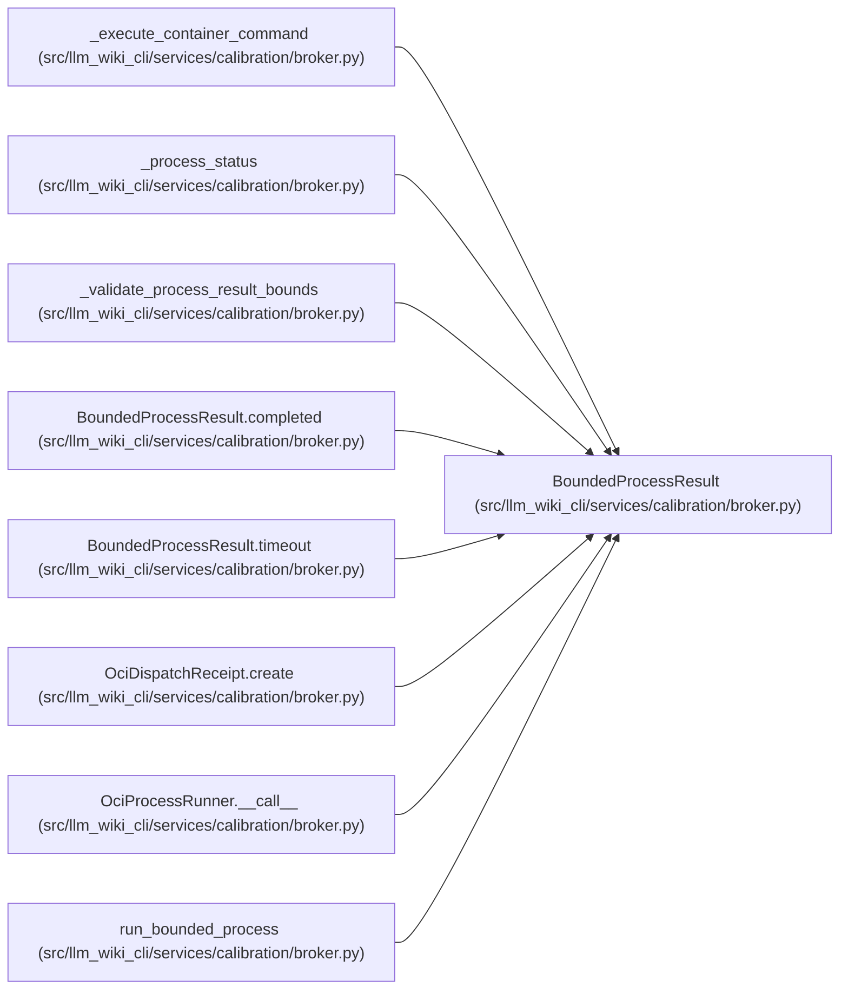

# BoundedProcessResult

**Location:** `src/llm_wiki_cli/services/calibration/broker.py:637`
**Kind:** Class
**Bases:** —
**Module:** [broker](../modules/broker.md)

**Decorators:** `@dataclass(frozen=True)`

## Description

Bounded in-memory output plus complete stream hashes and byte counts.

## Attributes

| Name | Type | Default | Description |
|------|------|---------|-------------|
| `started` | `bool` | *required* | — |
| `returncode` | `Optional[int]` | *required* | — |
| `timed_out` | `bool` | *required* | — |
| `error` | `Optional[str]` | *required* | — |
| `stdout` | `bytes` | *required* | — |
| `stderr` | `bytes` | *required* | — |
| `stdout_bytes` | `int` | *required* | — |
| `stderr_bytes` | `int` | *required* | — |
| `stdout_sha256` | `str` | *required* | — |
| `stderr_sha256` | `str` | *required* | — |
| `stdout_truncated` | `bool` | *required* | — |
| `stderr_truncated` | `bool` | *required* | — |

## Methods

| Method | Signature | Decorators | Description |
|--------|-----------|------------|-------------|
| `__post_init__` | `() -> None` | — | — |
| `completed` | `(*, returncode: int = 0, stdout: bytes = b'', stderr: bytes = b'') -> 'BoundedProcessResult'` | `@classmethod` | Build deterministic bounded-process evidence with fully captured output. |
| `timeout` | `(*, stdout: bytes = b'', stderr: bytes = b'') -> 'BoundedProcessResult'` | `@classmethod` | Build deterministic bounded-process evidence for a timeout. |

## Relationships

<!-- Auto-generated relationship summary. Do not edit by hand. -->

### Summary

| Module | Methods | Attributes |
|---|---:|---|
| [broker](../modules/broker.md) | 3 | `error`, `returncode`, `started`, `stderr`, `stderr_bytes`, `stderr_sha256`, `stderr_truncated`, `stdout`, `stdout_bytes`, `stdout_sha256`, `stdout_truncated`, `timed_out` |

### References

| Reference | Kind | Source | Call sites |
|---|---|---|---:|
| `_execute_container_command` | type_reference | [broker](../modules/broker.md) | — |
| `_process_status` | type_reference | [broker](../modules/broker.md) | — |
| `_validate_process_result_bounds` | type_reference | [broker](../modules/broker.md) | — |
| `BoundedProcessResult.completed` | type_reference | [broker](../modules/broker.md) | — |
| `BoundedProcessResult.timeout` | type_reference | [broker](../modules/broker.md) | — |
| `OciDispatchReceipt.create` | type_reference | [broker](../modules/broker.md) | — |
| `OciProcessRunner.__call__` | type_reference | [broker](../modules/broker.md) | — |
| `run_bounded_process` | call | [broker](../modules/broker.md) | 2 |
| `run_bounded_process` | type_reference | [broker](../modules/broker.md) | — |
