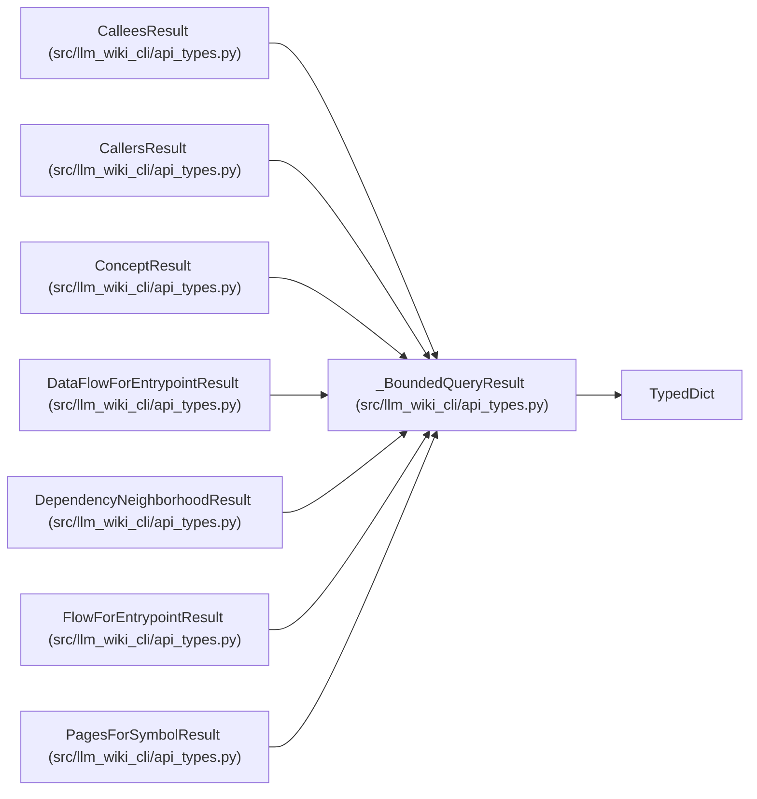

# _BoundedQueryResult

**Location:** `src/llm_wiki_cli/api_types.py:165`
**Kind:** Class
**Bases:** `TypedDict`
**Module:** [api_types](../modules/api_types.md)

## Description

Fields shared by bounded documentation graph queries.

## Attributes

| Name | Type | Default | Description |
|------|------|---------|-------------|
| `query` | `str` | *required* | — |
| `found` | `bool` | *required* | — |
| `ambiguous` | `bool` | *required* | — |
| `matches` | `list[dict[str, Any]]` | *required* | — |
| `truncated` | `bool` | *required* | — |
| `bounds` | `dict[str, Any]` | *required* | — |

## Methods

*No public methods. Inherits from base classes.*

## Relationships

<!-- Auto-generated relationship summary. Do not edit by hand. -->

### Summary

| Module | Methods | Attributes |
|---|---:|---|
| [api_types](../modules/api_types.md) | 0 | `ambiguous`, `bounds`, `found`, `matches`, `query`, `truncated` |

### Structure

| Kind | Entity | Module |
|---|---|---|
| Base | `TypedDict` | — |
| Subclass | `CalleesResult` | [api_types](../modules/api_types.md) |
| Subclass | `CallersResult` | [api_types](../modules/api_types.md) |
| Subclass | `ConceptResult` | [api_types](../modules/api_types.md) |
| Subclass | `DataFlowForEntrypointResult` | [api_types](../modules/api_types.md) |
| Subclass | `DependencyNeighborhoodResult` | [api_types](../modules/api_types.md) |
| Subclass | `FlowForEntrypointResult` | [api_types](../modules/api_types.md) |
| Subclass | `PagesForSymbolResult` | [api_types](../modules/api_types.md) |
