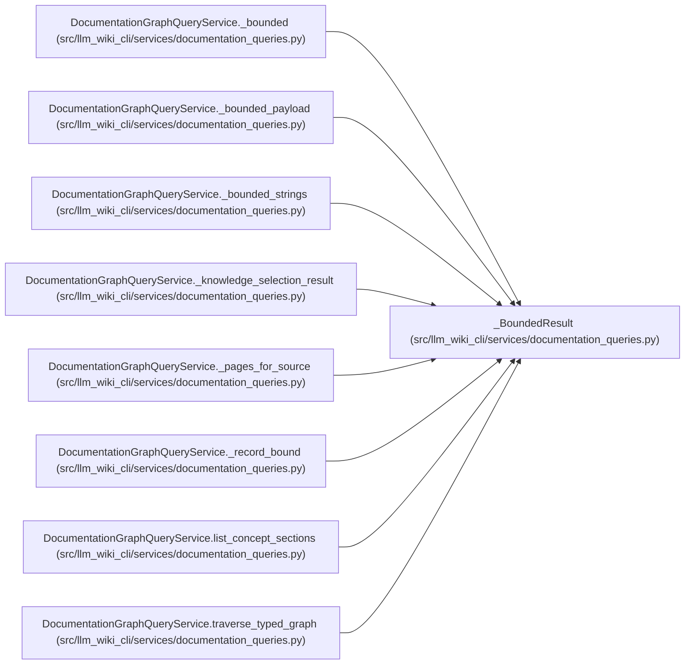

# _BoundedResult

**Location:** `src/llm_wiki_cli/services/documentation_queries.py:71`
**Kind:** Class
**Bases:** —
**Module:** [documentation_queries](../modules/documentation_queries.md)

**Decorators:** `@dataclass(frozen=True)`

## Description

One deterministic collection plus its exact response bounds.

## Attributes

| Name | Type | Default | Description |
|------|------|---------|-------------|
| `items` | `list[Any]` | *required* | — |
| `total` | `int` | *required* | — |

## Methods

| Method | Signature | Decorators | Description |
|--------|-----------|------------|-------------|
| `returned` | `() -> int` | `@property` | — |
| `truncated` | `() -> bool` | `@property` | — |
| `metadata` | `() -> dict[str, Any]` | — | — |

## Relationships

<!-- Auto-generated relationship summary. Do not edit by hand. -->

### Summary

| Module | Methods | Attributes |
|---|---:|---|
| [documentation_queries](../modules/documentation_queries.md) | 3 | `items`, `total` |

### References

| Reference | Kind | Source |
|---|---|---|
| `DocumentationGraphQueryService._bounded` | call | [documentation_queries](../modules/documentation_queries.md) |
| `DocumentationGraphQueryService._bounded` | type_reference | [documentation_queries](../modules/documentation_queries.md) |
| `DocumentationGraphQueryService._bounded_payload` | type_reference | [documentation_queries](../modules/documentation_queries.md) |
| `DocumentationGraphQueryService._bounded_strings` | call | [documentation_queries](../modules/documentation_queries.md) |
| `DocumentationGraphQueryService._bounded_strings` | type_reference | [documentation_queries](../modules/documentation_queries.md) |
| `DocumentationGraphQueryService._knowledge_selection_result` | call | [documentation_queries](../modules/documentation_queries.md) |
| `DocumentationGraphQueryService._pages_for_source` | type_reference | [documentation_queries](../modules/documentation_queries.md) |
| `DocumentationGraphQueryService._record_bound` | type_reference | [documentation_queries](../modules/documentation_queries.md) |
| `DocumentationGraphQueryService.list_concept_sections` | call | [documentation_queries](../modules/documentation_queries.md) |
| `DocumentationGraphQueryService.list_concept_sections` | call | [documentation_queries](../modules/documentation_queries.md) |
| `DocumentationGraphQueryService.traverse_typed_graph` | call | [documentation_queries](../modules/documentation_queries.md) |
