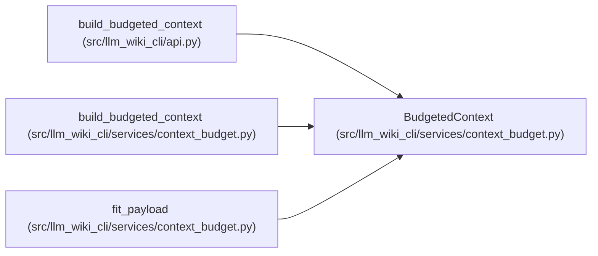

# BudgetedContext

**Location:** `src/llm_wiki_cli/services/context_budget.py:26`
**Kind:** Class
**Bases:** —
**Module:** [context_budget](../modules/context_budget.md)

**Decorators:** `@dataclass(frozen=True)`

## Description

_Auto-generated from `BudgetedContext` in `src/llm_wiki_cli/services/context_budget.py`._

## Attributes

| Name | Type | Default | Description |
|------|------|---------|-------------|
| `ok` | `bool` | *required* | — |
| `rendered` | `str` | *required* | — |
| `accounting` | `Mapping[str, Any]` | *required* | — |
| `error` | `str \| None` | `None` | — |

## Methods

*No public methods. Inherits from base classes.*

## Relationships

<!-- Auto-generated relationship summary. Do not edit by hand. -->

### Summary

| Module | Methods | Attributes |
|---|---:|---|
| [context_budget](../modules/context_budget.md) | 0 | `accounting`, `error`, `ok`, `rendered` |

### References

| Reference | Kind | Source | Call sites |
|---|---|---|---:|
| `build_budgeted_context` | type_reference | [api](../modules/api.md) | — |
| `build_budgeted_context` | type_reference | [context_budget](../modules/context_budget.md) | — |
| `fit_payload` | call | [context_budget](../modules/context_budget.md) | 2 |
