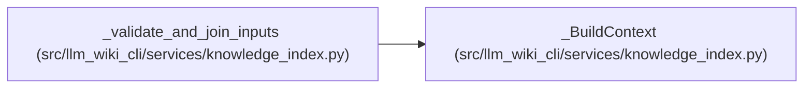

# _BuildContext

**Location:** `src/llm_wiki_cli/services/knowledge_index.py:196`
**Kind:** Class
**Bases:** —
**Module:** [knowledge_index](../modules/knowledge_index.md)

**Decorators:** `@dataclass(frozen=True)`

## Description

_Auto-generated from `_BuildContext` in `src/llm_wiki_cli/services/knowledge_index.py`._

## Attributes

| Name | Type | Default | Description |
|------|------|---------|-------------|
| `bundle` | `BundleRecord` | *required* | — |
| `joined_pages` | `tuple[_JoinedPage, ...]` | *required* | — |
| `joined_by_path` | `Mapping[str, _JoinedPage]` | *required* | — |
| `observations` | `tuple[LinkObservation, ...]` | *required* | — |

## Methods

*No public methods. Inherits from base classes.*

## Relationships

<!-- Auto-generated relationship summary. Do not edit by hand. -->

### Summary

| Module | Methods | Attributes |
|---|---:|---|
| [knowledge_index](../modules/knowledge_index.md) | 0 | `bundle`, `joined_by_path`, `joined_pages`, `observations` |

### References

| Reference | Kind | Source |
|---|---|---|
| `_validate_and_join_inputs` | call | [knowledge_index](../modules/knowledge_index.md) |
| `_validate_and_join_inputs` | type_reference | [knowledge_index](../modules/knowledge_index.md) |
