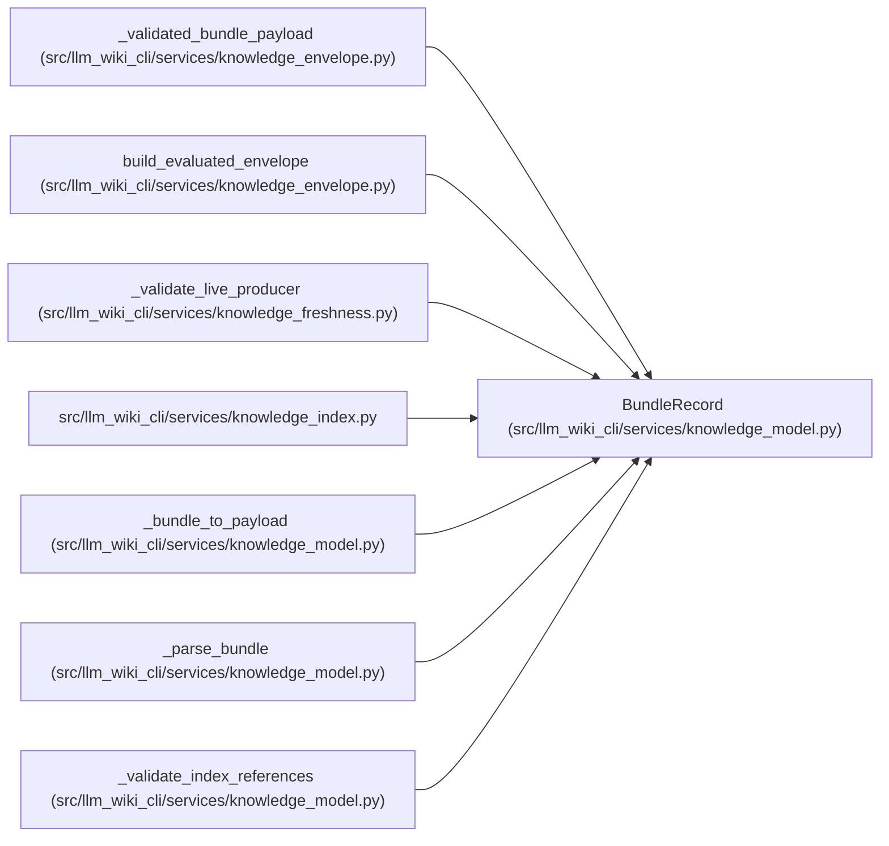

# BundleRecord

**Location:** `src/llm_wiki_cli/services/knowledge_model.py:319`
**Kind:** Class
**Bases:** —
**Module:** [knowledge_model](../modules/knowledge_model.md)

**Decorators:** `@dataclass(frozen=True)`

## Description

_Auto-generated from `BundleRecord` in `src/llm_wiki_cli/services/knowledge_model.py`._

## Attributes

| Name | Type | Default | Description |
|------|------|---------|-------------|
| `repository` | `RepositoryRecord` | *required* | — |
| `snapshot` | `SnapshotRecord` | *required* | — |
| `producer` | `ProducerRecord` | *required* | — |
| `extensions` | `Extensions` | `field(default_factory=dict)` | — |

## Methods

*No public methods. Inherits from base classes.*

## Relationships

<!-- Auto-generated relationship summary. Do not edit by hand. -->

### Summary

| Module | Methods | Attributes |
|---|---:|---|
| [knowledge_model](../modules/knowledge_model.md) | 0 | `extensions`, `producer`, `repository`, `snapshot` |

### References

| Reference | Kind | Source |
|---|---|---|
| `_validated_bundle_payload` | type_reference | [knowledge_envelope](../modules/knowledge_envelope.md) |
| `build_evaluated_envelope` | call | [knowledge_envelope](../modules/knowledge_envelope.md) |
| `_validate_live_producer` | call | [knowledge_freshness](../modules/knowledge_freshness.md) |
| `knowledge_index` | import | [knowledge_index](../modules/knowledge_index.md) |
| `_bundle_to_payload` | type_reference | [knowledge_model](../modules/knowledge_model.md) |
| `_parse_bundle` | call | [knowledge_model](../modules/knowledge_model.md) |
| `_parse_bundle` | type_reference | [knowledge_model](../modules/knowledge_model.md) |
| `_validate_index_references` | type_reference | [knowledge_model](../modules/knowledge_model.md) |
