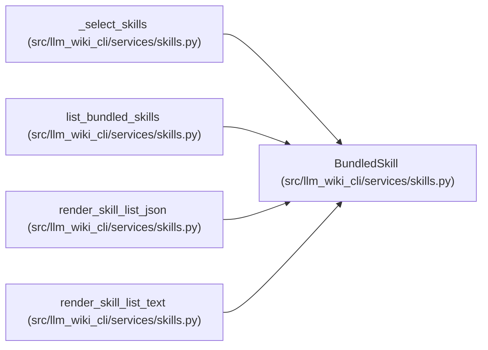

# BundledSkill

**Location:** `src/llm_wiki_cli/services/skills.py:63`
**Kind:** Class
**Bases:** —
**Module:** [skills](../modules/skills.md)

**Decorators:** `@dataclass(frozen=True)`

## Description

_Auto-generated from `BundledSkill` in `src/llm_wiki_cli/services/skills.py`._

## Attributes

| Name | Type | Default | Description |
|------|------|---------|-------------|
| `skill_id` | `str` | *required* | — |
| `name` | `str` | *required* | — |
| `description` | `str` | *required* | — |
| `path` | `Path` | *required* | — |
| `files` | `tuple[str, ...]` | *required* | — |

## Methods

| Method | Signature | Decorators | Description |
|--------|-----------|------------|-------------|
| `to_dict` | `() -> dict[str, Any]` | — | — |

## Relationships

<!-- Auto-generated relationship summary. Do not edit by hand. -->

### Summary

| Module | Methods | Attributes |
|---|---:|---|
| [skills](../modules/skills.md) | 1 | `description`, `files`, `name`, `path`, `skill_id` |

### References

| Reference | Kind | Source |
|---|---|---|
| `_select_skills` | type_reference | [skills](../modules/skills.md) |
| `list_bundled_skills` | call | [skills](../modules/skills.md) |
| `list_bundled_skills` | type_reference | [skills](../modules/skills.md) |
| `render_skill_list_json` | type_reference | [skills](../modules/skills.md) |
| `render_skill_list_text` | type_reference | [skills](../modules/skills.md) |
