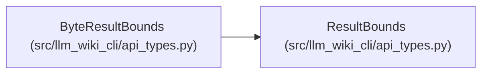

# ByteResultBounds

**Location:** `src/llm_wiki_cli/api_types.py:25`
**Kind:** Class
**Bases:** `ResultBounds`
**Module:** [api_types](../modules/api_types.md)

## Description

Serialized-byte bound with its independent hard limit.

## Attributes

| Name | Type | Default | Description |
|------|------|---------|-------------|
| `limit` | `int` | *required* | — |

## Methods

*No public methods. Inherits from base classes.*

## Relationships

<!-- Auto-generated relationship summary. Do not edit by hand. -->

### Summary

| Module | Methods | Attributes |
|---|---:|---|
| [api_types](../modules/api_types.md) | 0 | `limit` |

### Structure

| Kind | Entity | Module |
|---|---|---|
| Base | `ResultBounds` | [api_types](../modules/api_types.md) |
