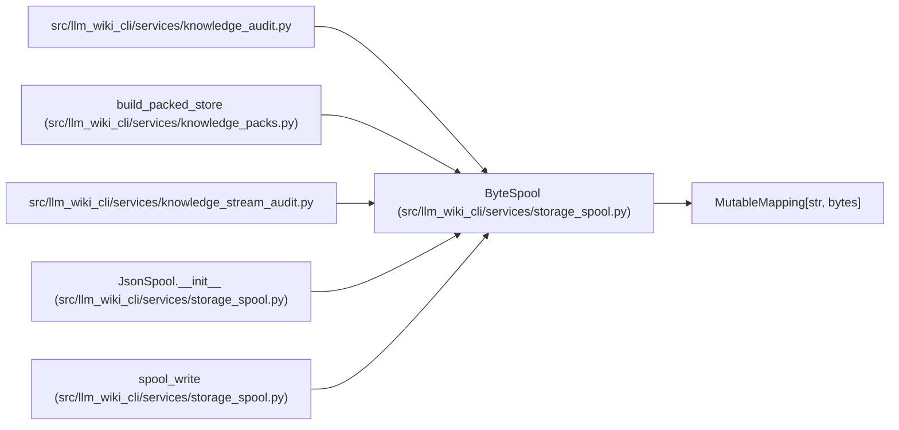

# ByteSpool

**Location:** `src/llm_wiki_cli/services/storage_spool.py:21`
**Kind:** Class
**Bases:** `MutableMapping[str, bytes]`
**Module:** [storage_spool](../modules/storage_spool.md)

## Description

Owns one private temporary file and a bounded index of immutable byte captures. Each read verifies the stored SHA-256 commitment, while append and metadata quotas prevent unbounded staging. Consumers must finish before the owning context closes.

## Attributes

*No annotated attributes found.*

## Methods

| Method | Signature | Decorators | Description |
|--------|-----------|------------|-------------|
| `__init__` | `(*, max_bytes: int = 2147483648, max_index_bytes: int = 16777216)` | — | — |
| `__getitem__` | `(key: str) -> bytes` | — | — |
| `__setitem__` | `(key: str, value: bytes) -> None` | — | — |
| `__delitem__` | `(key: str) -> None` | — | — |
| `__iter__` | `() -> Iterator[str]` | — | — |
| `__len__` | `() -> int` | — | — |
| `__contains__` | `(key) -> bool` | — | — |
| `close` | `() -> None` | — | — |
| `__enter__` | `()` | — | — |
| `__exit__` | `(*exc)` | — | — |

## Relationships

<!-- Auto-generated relationship summary. Do not edit by hand. -->

### Summary

| Module | Methods | Attributes |
|---|---:|---|
| [storage_spool](../modules/storage_spool.md) | 10 | — |

### Structure

| Kind | Entity | Module |
|---|---|---|
| Base | `MutableMapping[str, bytes]` | — |

### References

| Reference | Kind | Source | Call sites |
|---|---|---|---:|
| `knowledge_audit` | import | [knowledge_audit](../modules/knowledge_audit.md) | — |
| `build_packed_store` | call | [knowledge_packs](../modules/knowledge_packs.md) | 1 |
| `knowledge_stream_audit` | import | [knowledge_stream_audit](../modules/knowledge_stream_audit.md) | — |
| `JsonSpool.__init__` | type_reference | [storage_spool](../modules/storage_spool.md) | — |
| `spool_write` | type_reference | [storage_spool](../modules/storage_spool.md) | — |
