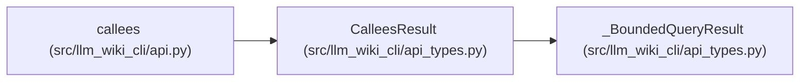

# CalleesResult

**Location:** `src/llm_wiki_cli/api_types.py:189`
**Kind:** Class
**Bases:** `_BoundedQueryResult`
**Module:** [api_types](../modules/api_types.md)

## Description

_Auto-generated from `CalleesResult` in `src/llm_wiki_cli/api_types.py`._

## Attributes

| Name | Type | Default | Description |
|------|------|---------|-------------|
| `callable` | `dict[str, Any] \| None` | *required* | — |
| `callees` | `list[dict[str, Any]]` | *required* | — |

## Methods

*No public methods. Inherits from base classes.*

## Relationships

<!-- Auto-generated relationship summary. Do not edit by hand. -->

### Summary

| Module | Methods | Attributes |
|---|---:|---|
| [api_types](../modules/api_types.md) | 0 | `callable`, `callees` |

### Structure

| Kind | Entity | Module |
|---|---|---|
| Base | `_BoundedQueryResult` | [api_types](../modules/api_types.md) |

### References

| Reference | Kind | Source | Call sites |
|---|---|---|---:|
| `callees` | type_reference | [api](../modules/api.md) | — |
