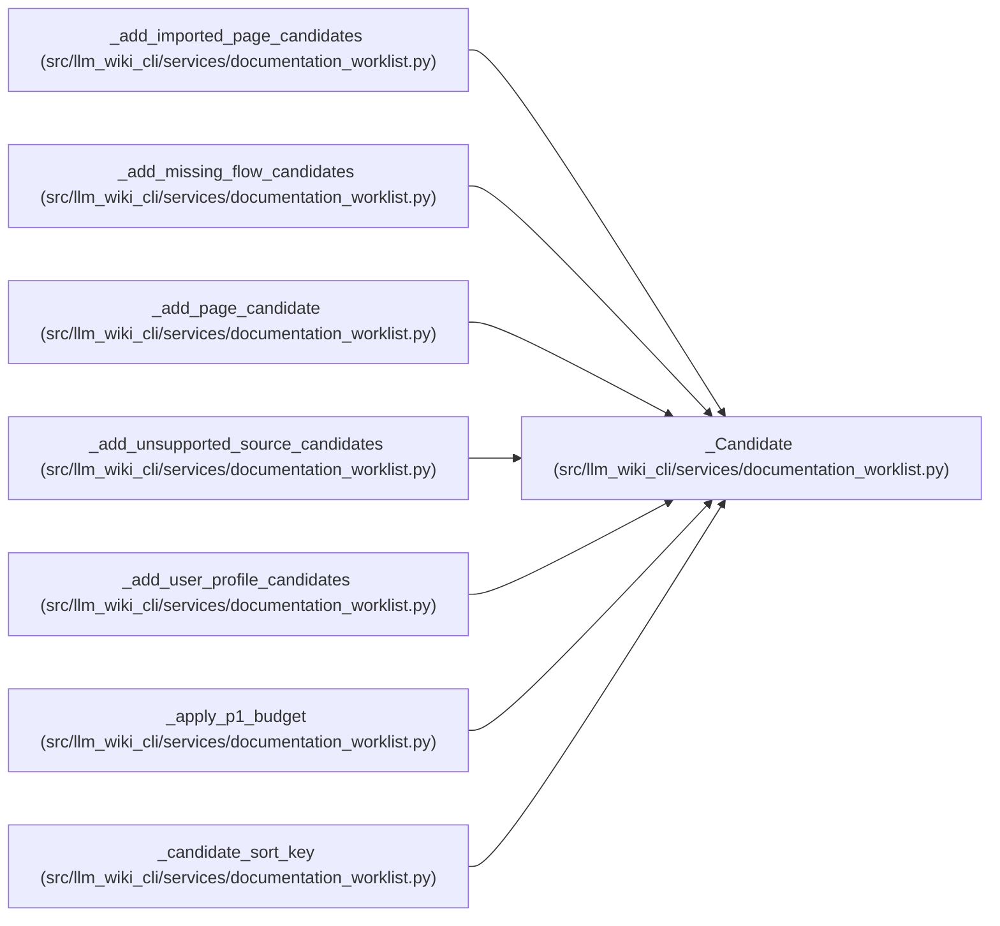

# _Candidate

**Location:** `src/llm_wiki_cli/services/documentation_worklist.py:216`
**Kind:** Class
**Bases:** —
**Module:** [documentation_worklist](../modules/documentation_worklist.md)

**Decorators:** `@dataclass`

## Description

_Auto-generated from `_Candidate` in `src/llm_wiki_cli/services/documentation_worklist.py`._

## Attributes

| Name | Type | Default | Description |
|------|------|---------|-------------|
| `identity` | `str` | *required* | — |
| `category` | `str` | *required* | — |
| `title` | `str` | *required* | — |
| `canonical_path` | `str \| None` | *required* | — |
| `source_path` | `str \| None` | *required* | — |
| `priority` | `str` | *required* | — |
| `rank_score` | `int` | `0` | — |
| `budget_candidate` | `bool` | `False` | — |
| `signals` | `set[str]` | `field(default_factory=set)` | — |
| `suggested_context` | `set[str]` | `field(default_factory=set)` | — |
| `acceptance_checks` | `set[str]` | `field(default_factory=set)` | — |
| `imported_classification` | `str \| None` | `None` | — |
| `reuse_eligible` | `bool` | `False` | — |
| `grounding_status` | `str` | `'unknown'` | — |
| `requested_defer` | `bool` | `False` | — |
| `deferral_reason` | `str \| None` | `None` | — |

## Methods

*No public methods. Inherits from base classes.*

## Relationships

<!-- Auto-generated relationship summary. Do not edit by hand. -->

### Summary

| Module | Methods | Attributes |
|---|---:|---|
| [documentation_worklist](../modules/documentation_worklist.md) | 0 | `acceptance_checks`, `budget_candidate`, `canonical_path`, `category`, `deferral_reason`, `grounding_status`, `identity`, `imported_classification`, `priority`, `rank_score`, `requested_defer`, `reuse_eligible` |

### References

| Reference | Kind | Source | Call sites |
|---|---|---|---:|
| `_add_imported_page_candidates` | call | [documentation_worklist](../modules/documentation_worklist.md) | 1 |
| `_add_imported_page_candidates` | type_reference | [documentation_worklist](../modules/documentation_worklist.md) | — |
| `_add_missing_flow_candidates` | call | [documentation_worklist](../modules/documentation_worklist.md) | 2 |
| `_add_missing_flow_candidates` | type_reference | [documentation_worklist](../modules/documentation_worklist.md) | — |
| `_add_page_candidate` | call | [documentation_worklist](../modules/documentation_worklist.md) | 1 |
| `_add_page_candidate` | type_reference | [documentation_worklist](../modules/documentation_worklist.md) | — |
| `_add_unsupported_source_candidates` | call | [documentation_worklist](../modules/documentation_worklist.md) | 1 |
| `_add_unsupported_source_candidates` | type_reference | [documentation_worklist](../modules/documentation_worklist.md) | — |
| `_add_user_profile_candidates` | call | [documentation_worklist](../modules/documentation_worklist.md) | 1 |
| `_add_user_profile_candidates` | type_reference | [documentation_worklist](../modules/documentation_worklist.md) | — |
| `_apply_p1_budget` | type_reference | [documentation_worklist](../modules/documentation_worklist.md) | — |
| `_candidate_sort_key` | type_reference | [documentation_worklist](../modules/documentation_worklist.md) | — |

> References: showing 12 of 14 logical references; 2 omitted by the 12-row generated summary limit.
