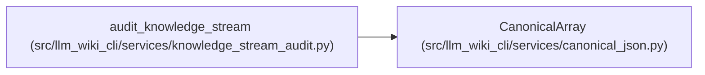

# CanonicalArray

**Location:** `src/llm_wiki_cli/services/canonical_json.py:21`
**Kind:** Class
**Bases:** —
**Module:** [canonical_json](../modules/canonical_json.md)

## Description

Marks a repeatable internal array stream for canonical JSON hashing. Spill-backed audit collections supply its values without building a complete list in memory. Ordering remains the responsibility of the collection supplying the stream.

## Attributes

*No annotated attributes found.*

## Methods

| Method | Signature | Decorators | Description |
|--------|-----------|------------|-------------|
| `__init__` | `(values)` | — | — |
| `__iter__` | `()` | — | — |

## Relationships

<!-- Auto-generated relationship summary. Do not edit by hand. -->

### Summary

| Module | Methods | Attributes |
|---|---:|---|
| [canonical_json](../modules/canonical_json.md) | 2 | — |

### References

| Reference | Kind | Source | Call sites |
|---|---|---|---:|
| `audit_knowledge_stream` | call | [knowledge_stream_audit](../modules/knowledge_stream_audit.md) | 3 |
