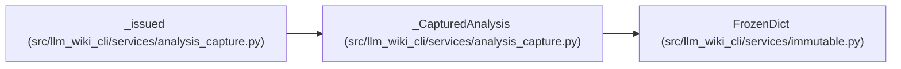

# _CapturedAnalysis

**Location:** `src/llm_wiki_cli/services/analysis_capture.py:21`
**Kind:** Class
**Bases:** `FrozenDict`
**Module:** [analysis_capture](../modules/analysis_capture.md)

## Description

_Auto-generated from `_CapturedAnalysis` in `src/llm_wiki_cli/services/analysis_capture.py`._

## Attributes

*No annotated attributes found.*

## Methods

| Method | Signature | Decorators | Description |
|--------|-----------|------------|-------------|
| `__init__` | `(values, token)` | — | — |
| `__deepcopy__` | `(memo)` | — | — |

## Relationships

<!-- Auto-generated relationship summary. Do not edit by hand. -->

### Summary

| Module | Methods | Attributes |
|---|---:|---|
| [analysis_capture](../modules/analysis_capture.md) | 2 | — |

### Structure

| Kind | Entity | Module |
|---|---|---|
| Base | `FrozenDict` | [immutable](../modules/immutable.md) |

### References

| Reference | Kind | Source | Call sites |
|---|---|---|---:|
| `_issued` | call | [analysis_capture](../modules/analysis_capture.md) | 1 |
