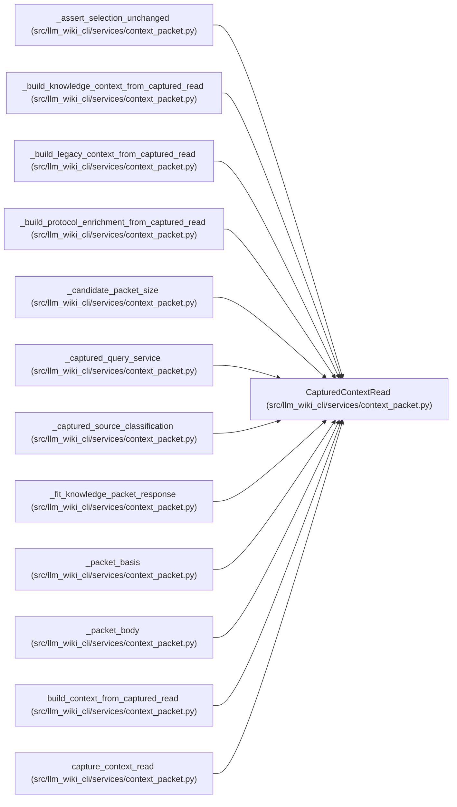

# CapturedContextRead

**Location:** `src/llm_wiki_cli/services/context_packet.py:301`
**Kind:** Class
**Bases:** —
**Module:** [context_packet](../modules/context_packet.md)

**Decorators:** `@dataclass(frozen=True)`

## Description

One coordinated in-memory source/wiki read used by a packet response.

## Attributes

| Name | Type | Default | Description |
|------|------|---------|-------------|
| `source_root` | `Path` | *required* | — |
| `wiki_root` | `Path` | *required* | — |
| `inventory_result` | `InventoryResult` | *required* | — |
| `source_snapshot` | `SourceSnapshot` | *required* | — |
| `inventory` | `Mapping[str, Any]` | *required* | — |
| `changed_files` | `tuple[str, ...] \| None` | *required* | — |
| `entrypoints` | `tuple[Mapping[str, Any], ...]` | *required* | — |
| `call_edges` | `tuple[Mapping[str, Any], ...]` | *required* | — |
| `flows` | `tuple[Mapping[str, Any], ...]` | *required* | — |
| `data_flows` | `tuple[Mapping[str, Any], ...]` | *required* | — |
| `dependency_analysis` | `Mapping[str, Any]` | *required* | — |
| `surface_evaluation` | `SurfaceIndexEvaluation` | *required* | — |
| `knowledge_view` | `KnowledgeReadView` | *required* | — |
| `source_anchor` | `str` | *required* | — |
| `wiki_anchor` | `str` | *required* | — |
| `basis_incompatible` | `bool` | `False` | — |
| `strict_wiki_symlinks` | `bool` | `False` | — |
| `allow_external_src` | `bool` | `False` | — |

## Methods

| Method | Signature | Decorators | Description |
|--------|-----------|------------|-------------|
| `__post_init__` | `() -> None` | — | — |

## Relationships

<!-- Auto-generated relationship summary. Do not edit by hand. -->

### Summary

| Module | Methods | Attributes |
|---|---:|---|
| [context_packet](../modules/context_packet.md) | 1 | `allow_external_src`, `basis_incompatible`, `call_edges`, `changed_files`, `data_flows`, `dependency_analysis`, `entrypoints`, `flows`, `inventory`, `inventory_result`, `knowledge_view`, `source_anchor` |

### References

| Reference | Kind | Source | Call sites |
|---|---|---|---:|
| `_assert_selection_unchanged` | type_reference | [context_packet](../modules/context_packet.md) | — |
| `_build_knowledge_context_from_captured_read` | type_reference | [context_packet](../modules/context_packet.md) | — |
| `_build_legacy_context_from_captured_read` | type_reference | [context_packet](../modules/context_packet.md) | — |
| `_build_protocol_enrichment_from_captured_read` | type_reference | [context_packet](../modules/context_packet.md) | — |
| `_candidate_packet_size` | type_reference | [context_packet](../modules/context_packet.md) | — |
| `_captured_query_service` | type_reference | [context_packet](../modules/context_packet.md) | — |
| `_captured_source_classification` | type_reference | [context_packet](../modules/context_packet.md) | — |
| `_fit_knowledge_packet_response` | type_reference | [context_packet](../modules/context_packet.md) | — |
| `_packet_basis` | type_reference | [context_packet](../modules/context_packet.md) | — |
| `_packet_body` | type_reference | [context_packet](../modules/context_packet.md) | — |
| `build_context_from_captured_read` | type_reference | [context_packet](../modules/context_packet.md) | — |
| `capture_context_read` | call | [context_packet](../modules/context_packet.md) | 1 |

> References: showing 12 of 13 logical references; 1 omitted by the 12-row generated summary limit.
