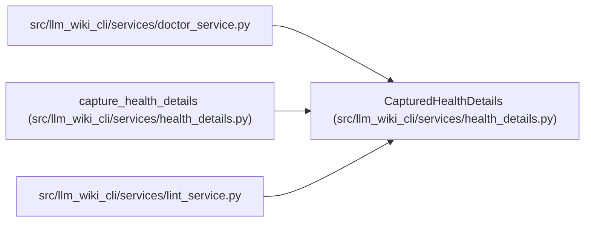

# CapturedHealthDetails

**Location:** `src/llm_wiki_cli/services/health_details.py:33`
**Kind:** Class
**Bases:** —
**Module:** [health_details](../modules/health_details.md)

**Decorators:** `@dataclass(frozen=True)`

## Description

An immutable capture with independently owned output dictionaries.

## Attributes

| Name | Type | Default | Description |
|------|------|---------|-------------|
| `encoded` | `str` | *required* | — |

## Methods

| Method | Signature | Decorators | Description |
|--------|-----------|------------|-------------|
| `to_payload` | `() -> dict[str, Any]` | — | — |

## Relationships

<!-- Auto-generated relationship summary. Do not edit by hand. -->

### Summary

| Module | Methods | Attributes |
|---|---:|---|
| [health_details](../modules/health_details.md) | 1 | `encoded` |

### References

| Reference | Kind | Source | Call sites |
|---|---|---|---:|
| `doctor_service` | import | [doctor_service](../modules/doctor_service.md) | — |
| `capture_health_details` | call | [health_details](../modules/health_details.md) | 1 |
| `capture_health_details` | type_reference | [health_details](../modules/health_details.md) | — |
| `lint_service` | import | [lint_service](../modules/lint_service.md) | — |
