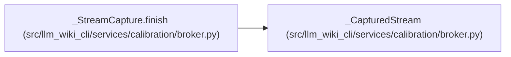

# _CapturedStream

**Location:** `src/llm_wiki_cli/services/calibration/broker.py:2528`
**Kind:** Class
**Bases:** —
**Module:** [broker](../modules/broker.md)

**Decorators:** `@dataclass(frozen=True)`

## Description

_Auto-generated from `_CapturedStream` in `src/llm_wiki_cli/services/calibration/broker.py`._

## Attributes

| Name | Type | Default | Description |
|------|------|---------|-------------|
| `data` | `bytes` | *required* | — |
| `total_bytes` | `int` | *required* | — |
| `sha256` | `str` | *required* | — |
| `truncated` | `bool` | *required* | — |

## Methods

*No public methods. Inherits from base classes.*

## Relationships

<!-- Auto-generated relationship summary. Do not edit by hand. -->

### Summary

| Module | Methods | Attributes |
|---|---:|---|
| [broker](../modules/broker.md) | 0 | `data`, `sha256`, `total_bytes`, `truncated` |

### References

| Reference | Kind | Source | Call sites |
|---|---|---|---:|
| `_StreamCapture.finish` | call | [broker](../modules/broker.md) | 1 |
| `_StreamCapture.finish` | type_reference | [broker](../modules/broker.md) | — |
