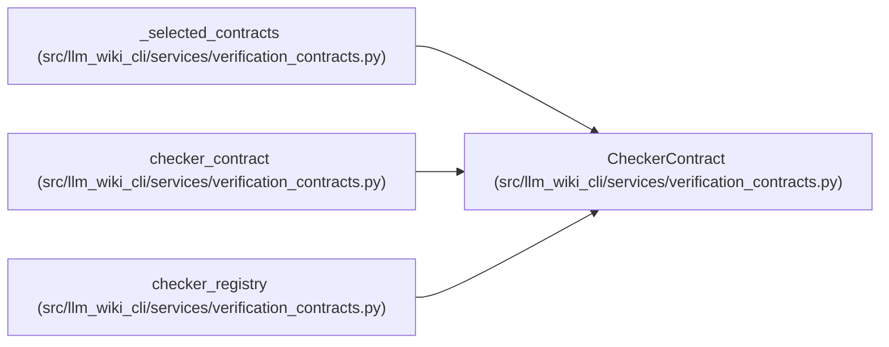

# CheckerContract

**Location:** `src/llm_wiki_cli/services/verification_contracts.py:417`
**Kind:** Class
**Bases:** —
**Module:** [verification_contracts](../modules/verification_contracts.md)

**Decorators:** `@dataclass(frozen=True)`

## Description

One immutable application-owned checker registration.

## Attributes

| Name | Type | Default | Description |
|------|------|---------|-------------|
| `checker_id` | `str` | *required* | — |
| `version` | `str` | *required* | — |
| `description` | `str` | *required* | — |
| `_runner` | `CheckerRunner` | `field(repr=False, compare=False)` | — |

## Methods

| Method | Signature | Decorators | Description |
|--------|-----------|------------|-------------|
| `__post_init__` | `() -> None` | — | — |
| `run` | `(context: VerificationContext) -> VerificationCheckResult` | — | Run this exact application-owned checker over supplied inputs. |

## Relationships

<!-- Auto-generated relationship summary. Do not edit by hand. -->

### Summary

| Module | Methods | Attributes |
|---|---:|---|
| [verification_contracts](../modules/verification_contracts.md) | 2 | `_runner`, `checker_id`, `description`, `version` |

### References

| Reference | Kind | Source |
|---|---|---|
| `_selected_contracts` | type_reference | [verification_contracts](../modules/verification_contracts.md) |
| `checker_contract` | type_reference | [verification_contracts](../modules/verification_contracts.md) |
| `checker_registry` | type_reference | [verification_contracts](../modules/verification_contracts.md) |
