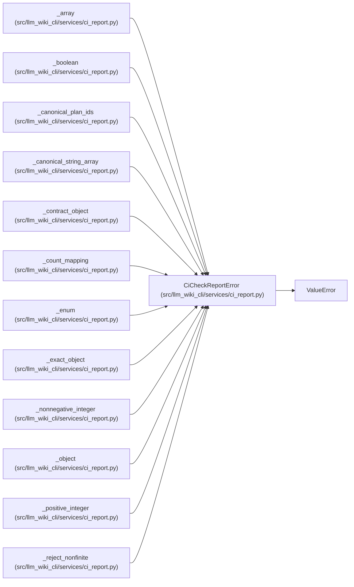

# CiCheckReportError

**Location:** `src/llm_wiki_cli/services/ci_report.py:173`
**Kind:** Class
**Bases:** `ValueError`
**Module:** [ci_report](../modules/ci_report.md)

## Description

A field-specific failure in the versioned CI report contract.

## Attributes

*No annotated attributes found.*

## Methods

*No public methods. Inherits from base classes.*

## Relationships

<!-- Auto-generated relationship summary. Do not edit by hand. -->

### Summary

| Module | Methods | Attributes |
|---|---:|---|
| [ci_report](../modules/ci_report.md) | 0 | — |

### Structure

| Kind | Entity | Module |
|---|---|---|
| Base | `ValueError` | — |

### References

| Reference | Kind | Source | Call sites |
|---|---|---|---:|
| `_array` | call | [ci_report](../modules/ci_report.md) | 1 |
| `_boolean` | call | [ci_report](../modules/ci_report.md) | 1 |
| `_canonical_plan_ids` | call | [ci_report](../modules/ci_report.md) | 1 |
| `_canonical_string_array` | call | [ci_report](../modules/ci_report.md) | 1 |
| `_contract_object` | call | [ci_report](../modules/ci_report.md) | 2 |
| `_count_mapping` | call | [ci_report](../modules/ci_report.md) | 1 |
| `_enum` | call | [ci_report](../modules/ci_report.md) | 1 |
| `_exact_object` | call | [ci_report](../modules/ci_report.md) | 2 |
| `_nonnegative_integer` | call | [ci_report](../modules/ci_report.md) | 1 |
| `_object` | call | [ci_report](../modules/ci_report.md) | 1 |
| `_positive_integer` | call | [ci_report](../modules/ci_report.md) | 1 |
| `_reject_nonfinite` | call | [ci_report](../modules/ci_report.md) | 1 |

> References: showing 12 of 21 logical references; 9 omitted by the 12-row generated summary limit.
