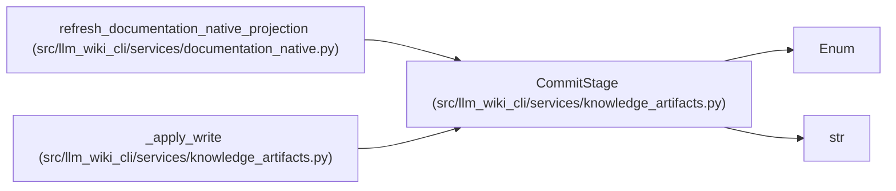

# CommitStage

**Location:** `src/llm_wiki_cli/services/knowledge_artifacts.py:89`
**Kind:** Enum
**Bases:** `str`, `Enum`
**Module:** [knowledge_artifacts](../modules/knowledge_artifacts.md)

## Description

Fault-injection points reached after each successful atomic replacement.

## Attributes

| Name | Declared value | Description |
|------|-------|-------------|
| `SURFACE_INDEX_WRITTEN` | `'surface-index-written'` | — |
| `KNOWLEDGE_INDEX_WRITTEN` | `'knowledge-index-written'` | — |
| `MANIFEST_WRITTEN` | `'manifest-written'` | — |

## Methods

*No public methods. Inherits from base classes.*

## Relationships

<!-- Auto-generated relationship summary. Do not edit by hand. -->

### Summary

| Module | Methods | Attributes |
|---|---:|---|
| [knowledge_artifacts](../modules/knowledge_artifacts.md) | 0 | `KNOWLEDGE_INDEX_WRITTEN`, `MANIFEST_WRITTEN`, `SURFACE_INDEX_WRITTEN` |

### Structure

| Kind | Entity | Module |
|---|---|---|
| Base | `Enum` | — |
| Base | `str` | — |

### References

| Reference | Kind | Source | Call sites |
|---|---|---|---:|
| `refresh_documentation_native_projection` | type_reference | [documentation_native](../modules/documentation_native.md) | — |
| `_apply_write` | type_reference | [knowledge_artifacts](../modules/knowledge_artifacts.md) | — |
