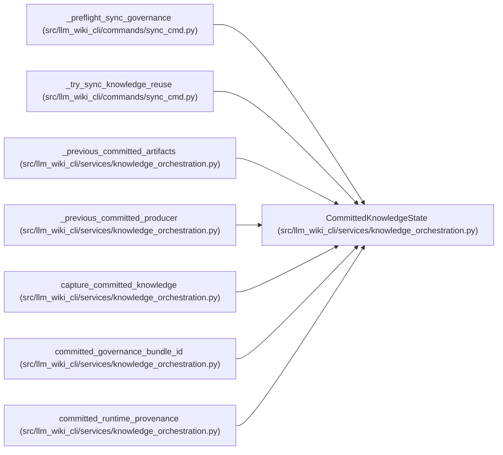

# CommittedKnowledgeState

**Location:** `src/llm_wiki_cli/services/knowledge_orchestration.py:177`
**Kind:** Class
**Bases:** —
**Module:** [knowledge_orchestration](../modules/knowledge_orchestration.md)

**Decorators:** `@dataclass(frozen=True)`

## Description

One command's captured prior commit, including explicit absent/invalid state.

## Attributes

| Name | Type | Default | Description |
|------|------|---------|-------------|
| `wiki_root` | `Path` | *required* | — |
| `artifacts` | `ValidatedKnowledgeArtifacts \| None` | `field(repr=False)` | — |
| `captured_bytes` | `Mapping[str, bytes \| None]` | `field(repr=False)` | — |
| `_issued` | `object \| None` | `field(default=None, init=False, repr=False, compare=False)` | — |

## Methods

| Method | Signature | Decorators | Description |
|--------|-----------|------------|-------------|
| `require_for` | `(wiki_dir: str \| Path) -> None` | — | — |
| `assert_current` | `() -> None` | — | — |

## Relationships

<!-- Auto-generated relationship summary. Do not edit by hand. -->

### Summary

| Module | Methods | Attributes |
|---|---:|---|
| [knowledge_orchestration](../modules/knowledge_orchestration.md) | 2 | `_issued`, `artifacts`, `captured_bytes`, `wiki_root` |

### References

| Reference | Kind | Source | Call sites |
|---|---|---|---:|
| `_preflight_sync_governance` | type_reference | [sync_cmd](../modules/sync_cmd.md) | — |
| `_try_sync_knowledge_reuse` | type_reference | [sync_cmd](../modules/sync_cmd.md) | — |
| `_previous_committed_artifacts` | type_reference | [knowledge_orchestration](../modules/knowledge_orchestration.md) | — |
| `_previous_committed_producer` | type_reference | [knowledge_orchestration](../modules/knowledge_orchestration.md) | — |
| `capture_committed_knowledge` | call | [knowledge_orchestration](../modules/knowledge_orchestration.md) | 1 |
| `capture_committed_knowledge` | type_reference | [knowledge_orchestration](../modules/knowledge_orchestration.md) | — |
| `committed_governance_bundle_id` | type_reference | [knowledge_orchestration](../modules/knowledge_orchestration.md) | — |
| `committed_runtime_provenance` | type_reference | [knowledge_orchestration](../modules/knowledge_orchestration.md) | — |
