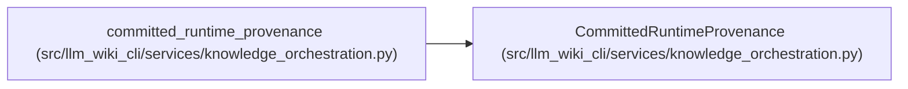

# CommittedRuntimeProvenance

**Location:** `src/llm_wiki_cli/services/knowledge_orchestration.py:172`
**Kind:** Class
**Bases:** —
**Module:** [knowledge_orchestration](../modules/knowledge_orchestration.md)

**Decorators:** `@dataclass(frozen=True)`

## Description

Exact runtime provenance recovered from an intact committed projection.

## Attributes

| Name | Type | Default | Description |
|------|------|---------|-------------|
| `source_snapshot_hash` | `str` | *required* | — |
| `generation_options_hash` | `str` | *required* | — |
| `generator_version` | `str` | *required* | — |

## Methods

*No public methods. Inherits from base classes.*

## Relationships

<!-- Auto-generated relationship summary. Do not edit by hand. -->

### Summary

| Module | Methods | Attributes |
|---|---:|---|
| [knowledge_orchestration](../modules/knowledge_orchestration.md) | 0 | `generation_options_hash`, `generator_version`, `source_snapshot_hash` |

### References

| Reference | Kind | Source |
|---|---|---|
| `committed_runtime_provenance` | call | [knowledge_orchestration](../modules/knowledge_orchestration.md) |
| `committed_runtime_provenance` | type_reference | [knowledge_orchestration](../modules/knowledge_orchestration.md) |
