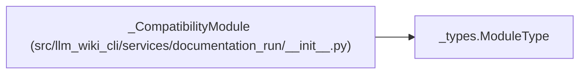

# _CompatibilityModule

**Location:** `src/llm_wiki_cli/services/documentation_run/__init__.py:218`
**Kind:** Class
**Bases:** `_types.ModuleType`
**Module:** [documentation_run___init__](../modules/documentation_run___init__.md)

## Description

Mirror compatibility monkeypatches into the owning role modules.

## Attributes

*No annotated attributes found.*

## Methods

| Method | Signature | Decorators | Description |
|--------|-----------|------------|-------------|
| `__setattr__` | `(name: str, value: object) -> None` | — | — |
| `__delattr__` | `(name: str) -> None` | — | — |

## Relationships

<!-- Auto-generated relationship summary. Do not edit by hand. -->

### Summary

| Module | Methods | Attributes |
|---|---:|---|
| [documentation_run___init__](../modules/documentation_run___init__.md) | 2 | — |

### Structure

| Kind | Entity | Module |
|---|---|---|
| Base | `_types.ModuleType` | — |
