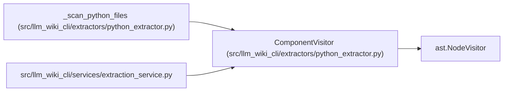

# ComponentVisitor

**Location:** `src/llm_wiki_cli/extractors/python_extractor.py:1034`
**Kind:** Class
**Bases:** `ast.NodeVisitor`
**Module:** [python_extractor](../modules/python_extractor.md)

## Description

_Auto-generated from `ComponentVisitor` in `src/llm_wiki_cli/extractors/python_extractor.py`._

## Attributes

*No annotated attributes found.*

## Methods

| Method | Signature | Decorators | Description |
|--------|-----------|------------|-------------|
| `__init__` | `(deep: bool = False, module_globals: set[str] \| None = None, module_import_aliases: dict[str, str] \| None = None, data_effect_observations: list[dict] \| None = None, import_location_observations: list[dict] \| None = None)` | — | — |
| `_import_scope` | `() -> str` | — | Classify where an import sits, or ``""`` when it runs at import time. |
| `_record_import` | `(record: dict, node: ast.Import \| ast.ImportFrom) -> None` | — | Retain the legacy import shape and optional source-location sidecar. |
| `visit_Import` | `(node)` | — | — |
| `visit_ImportFrom` | `(node)` | — | — |
| `visit_ClassDef` | `(node)` | — | — |
| `visit_FunctionDef` | `(node)` | — | — |
| `visit_AsyncFunctionDef` | `(node)` | — | — |
| `visit_Assign` | `(node)` | — | Detect module-level UPPER_CASE constants and ``__all__``. |
| `visit_AnnAssign` | `(node)` | — | Detect explicit PEP 613 module-level type aliases. |
| `visit_TypeAlias` | `(node)` | — | Detect PEP 695 aliases when the running Python parser supports them. |
| `visit_Module` | `(node)` | — | Seed the ``TYPE_CHECKING`` aliases before walking the module body. |
| `visit_If` | `(node)` | — | Detect the ``__main__`` entry guard and the ``TYPE_CHECKING`` guard. |

## Relationships

<!-- Auto-generated relationship summary. Do not edit by hand. -->

### Summary

| Module | Methods | Attributes |
|---|---:|---|
| [python_extractor](../modules/python_extractor.md) | 13 | — |

### Structure

| Kind | Entity | Module |
|---|---|---|
| Base | `ast.NodeVisitor` | — |

### References

| Reference | Kind | Source | Call sites |
|---|---|---|---:|
| `_scan_python_files` | call | [python_extractor](../modules/python_extractor.md) | 1 |
| `extraction_service` | import | [extraction_service](../modules/extraction_service.md) | — |
