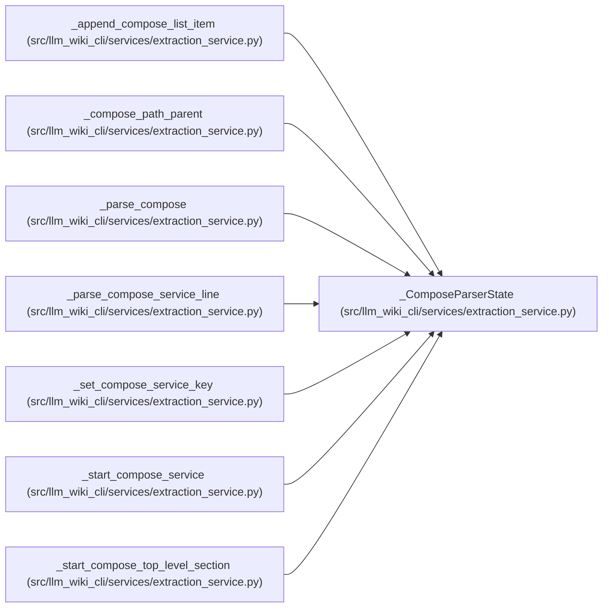

# _ComposeParserState

**Location:** `src/llm_wiki_cli/services/extraction_service.py:2944`
**Kind:** Class
**Bases:** —
**Module:** [extraction_service](../modules/extraction_service.md)

**Decorators:** `@dataclass`

## Description

_Auto-generated from `_ComposeParserState` in `src/llm_wiki_cli/services/extraction_service.py`._

## Attributes

| Name | Type | Default | Description |
|------|------|---------|-------------|
| `services` | `dict[str, dict]` | `field(default_factory=dict)` | — |
| `networks` | `list[str]` | `field(default_factory=list)` | — |
| `named_volumes` | `list[str]` | `field(default_factory=list)` | — |
| `current_top` | `str` | `''` | — |
| `current_service` | `str` | `''` | — |
| `key_stack` | `list[str]` | `field(default_factory=list)` | — |

## Methods

*No public methods. Inherits from base classes.*

## Relationships

<!-- Auto-generated relationship summary. Do not edit by hand. -->

### Summary

| Module | Methods | Attributes |
|---|---:|---|
| [extraction_service](../modules/extraction_service.md) | 0 | `current_service`, `current_top`, `key_stack`, `named_volumes`, `networks`, `services` |

### References

| Reference | Kind | Source | Call sites |
|---|---|---|---:|
| `_append_compose_list_item` | type_reference | [extraction_service](../modules/extraction_service.md) | — |
| `_compose_path_parent` | type_reference | [extraction_service](../modules/extraction_service.md) | — |
| `_parse_compose` | call | [extraction_service](../modules/extraction_service.md) | 1 |
| `_parse_compose_service_line` | type_reference | [extraction_service](../modules/extraction_service.md) | — |
| `_set_compose_service_key` | type_reference | [extraction_service](../modules/extraction_service.md) | — |
| `_start_compose_service` | type_reference | [extraction_service](../modules/extraction_service.md) | — |
| `_start_compose_top_level_section` | type_reference | [extraction_service](../modules/extraction_service.md) | — |
